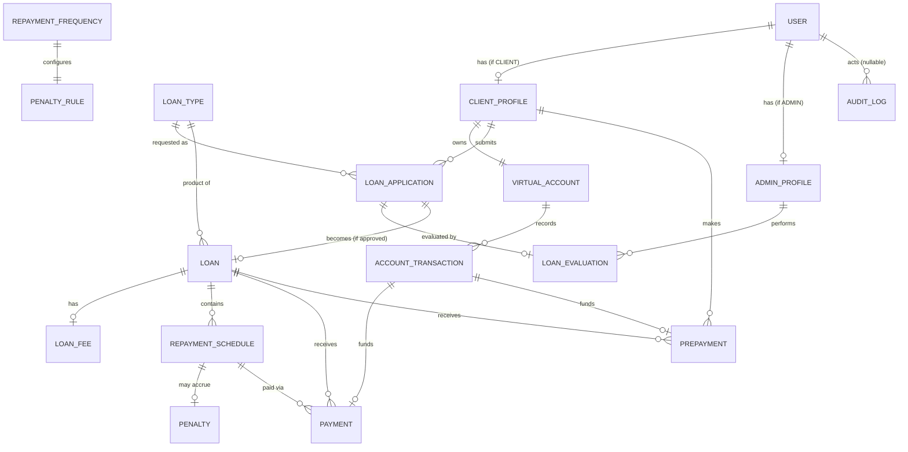

# Loan Management and Evaluation System — Project Explanation

This document explains the **actual implemented system**, not an idealized plan. Where the
implementation differs from what a naive reading of the original spec (`prompt.md`, which is
intentionally not committed to this repository and is not modified by this document) might
suggest, that difference is called out explicitly.

This document is written for a developer who has never seen the code and wants to understand not
just *what* it does, but *why* it was built this way, what the alternatives were, and when those
alternatives would actually be the better choice.

---

# 1. Project Overview

## What problem this application solves

A bank (or any lender) needs to: onboard borrowers, let them apply for loans, have a human
underwriter evaluate and price those applications, collect an approval fee, disburse funds, and
then collect repayments over time — including handling late payments and early payoffs. This
project is a **local, single-machine implementation** of that entire lifecycle, backed by a real
relational database, with no external banking integration (there is no real money movement —
the "Virtual Bank Account" is an internal ledger inside this application).

## Who uses it

| Role | Can do |
|---|---|
| **CLIENT** | Register, manage their own profile, browse loan types, apply for a loan, preview repayment terms, track application status (including a mandatory rejection reason if rejected), pay the approval fee, view the auto-generated repayment schedule, pay EMIs, make principal prepayments, and view their Virtual Account and full transaction ledger. |
| **ADMIN** | Everything a bank's back-office/underwriting team does: review applications with the client's financial profile visible, approve (setting the approval fee %) or reject (with a mandatory reason), view all loans and their schedules, and edit **Master Configuration** — loan products, duration limits, approval fee limits, repayment frequencies, and penalty rates — with every change audit-logged. |

There is deliberately **no third role**. The spec explicitly says there is no separate "Banker"
role — the ADMIN does both underwriting and back-office configuration. This keeps the
authorization model to a single boolean-like check (`role in (CLIENT, ADMIN)`) instead of a more
general permission system, which would be over-engineering for two roles with non-overlapping
capabilities.

## Main capabilities (end to end)

Registration → profile completion → loan application → backend-calculated repayment preview →
admin review → approve (with fee %) or reject (with reason) → approval fee payment → automatic
fund disbursement → automatic repayment schedule generation → EMI payments → optional principal
prepayments → automatic overdue detection and penalty accrual → automatic loan completion — all
while a complete, human-readable **audit trail** is kept.

## Technology stack

| Layer | Technology | One-line reason (expanded in [§23](#23-why-these-technologies)) |
|---|---|---|
| Backend | Python 3.12 + FastAPI | async-capable, typed, automatic OpenAPI docs, minimal boilerplate |
| ORM | SQLAlchemy 2.x (typed `Mapped[...]` style) | mature, explicit, works with Alembic |
| Validation | Pydantic v2 | the same library FastAPI already uses for request/response models |
| Migrations | Alembic | schema changes as reviewable, revertible code, not manual SQL |
| Database | MySQL 8 | explicitly required by the spec; real relational integrity |
| Auth | PyJWT + Argon2 (`argon2-cffi`) | stateless tokens; Argon2 is the current best-practice password hash |
| Frontend | React 18 + TypeScript + Vite | fast dev loop, static typing catches API-contract drift at compile time |
| Testing | Pytest | runs directly against a real MySQL test database (no SQLite shortcut) |

## Why this architecture (modular monolith)

```text
React + TypeScript
        |
        | HTTP / REST (fetch, JWT bearer token)
        v
FastAPI Application (single process)
        |
        v
Routers            app/api/v1/*.py        <- HTTP concerns only: path, status code, auth dependency
        |
        v
Services           app/services/*.py      <- validation, orchestration, transactions, audit
        |
        v
Calculations       app/calculations/*.py  <- pure functions: EMI, schedule, fee, penalty math
        |
        v
Repositories       app/repositories/*.py  <- the only layer that writes SQLAlchemy queries
        |
        v
SQLAlchemy ORM
        |
        v
MySQL
```

Every arrow is a **one-way dependency**. A router never imports a repository directly; a
repository never imports a service. This is enforced by convention (there is no separate service
boundary tool like a linter rule for it), but it is consistently followed throughout the codebase
and is easy to verify by reading any router file — none of them contain a `select()` statement or
a business rule.

### Why a modular monolith and not microservices

- **The whole system shares one transaction boundary.** Approving a fee payment has to
  atomically: debit the ledger, mark the fee paid, credit the loan amount, generate a schedule,
  and activate the loan. If any step fails, *all* of it must roll back. In a microservice split
  (e.g. a separate "Accounts" service and a separate "Loans" service), this single business
  transaction would become a **distributed transaction** — you'd need a saga, two-phase commit,
  or eventual-consistency compensation logic, all of which exist specifically to solve a problem
  this project doesn't have (multiple databases). Introducing that machinery here would be pure
  overhead with zero benefit, since everything already lives in one MySQL database.
- **Team size and deployment target.** Microservices pay for themselves when multiple teams need
  to deploy independently, or when different parts of the system have wildly different scaling
  needs. This is a single local application for a single machine — there is exactly one team
  (you), one deployment, and no scaling requirement beyond "runs on a laptop."
- **The spec explicitly excludes the infrastructure microservices would require** — Docker,
  Kubernetes, message queues (Kafka), and cloud deployment are all out of scope. Building
  microservices without that infrastructure would mean multiple Python processes talking over
  bare HTTP with no service discovery, no resilience patterns, and no operational tooling — strictly
  worse than one process, for no gain.
- **A monolith does not mean "unstructured."** The layering above (`api → services → calculations
  → repositories → db`) gives the same separation of concerns a microservice boundary would give
  (you *could* later extract "Master Configuration" into its own service, because it already only
  talks to the rest of the system through `app/services/master_service.py`), without paying the
  distributed-systems tax today.

### How frontend, backend, and database communicate

- Frontend → Backend: plain `fetch()` calls (see `frontend/src/services/api.ts`) to
  `http://localhost:8000/api/v1/...`, with a `Authorization: Bearer <jwt>` header attached once a
  user is logged in. No GraphQL, no gRPC, no WebSockets — a small, entirely CRUD-shaped domain
  does not benefit from any of those, and REST/JSON keeps the FastAPI-generated OpenAPI docs
  useful as the single source of truth for the contract.
- Backend → Database: SQLAlchemy's Core/ORM layer over the `pymysql` DBAPI driver (a pure-Python
  MySQL client — chosen over `mysqlclient`/`PyMySQL`'s C-extension sibling specifically so the
  project never needs a C compiler to install, matching the "must just run on Windows" constraint
  in the spec).

---

# 2. Complete Project Structure

```text
Loan_Task/                          (git repository root, branch: implementation)
├── .gitignore                      ignores .env, venv/, node_modules/, PROMPT.MD, build output
├── PROJECT_PLAN.md                 the phased plan written before implementation began
├── README.md                       setup instructions (MySQL, backend, frontend, tests)
├── ARCHITECTURE.md                 system architecture, module map, data flow, security summary
├── DATABASE.md                     full schema reference
├── API.md                          full endpoint reference
├── PROJECT_EXPLANATION.md          this file
│
├── backend/
│   ├── requirements.txt            pinned Python dependencies
│   ├── .env.example                placeholder env vars (committed)
│   ├── .env                        real local secrets (NOT committed)
│   ├── pytest.ini                  test discovery + import path config
│   ├── alembic.ini                 Alembic config (URL is injected from .env at runtime)
│   ├── seed.py                     idempotent dev-data seed script
│   ├── alembic/
│   │   ├── env.py                  wires Alembic to the app's settings and metadata
│   │   ├── script.py.mako          template for new migration files
│   │   └── versions/               the two migrations that exist so far
│   ├── app/
│   │   ├── main.py                 FastAPI app instance, CORS, global exception handler
│   │   ├── core/
│   │   │   ├── config.py           typed Settings loaded from .env (pydantic-settings)
│   │   │   └── security.py         Argon2 hashing + JWT encode/decode
│   │   ├── db/
│   │   │   ├── base.py             SQLAlchemy declarative Base + model registration
│   │   │   └── session.py          engine, SessionLocal, get_db() FastAPI dependency
│   │   ├── models/                 19 SQLAlchemy ORM entities + shared enums/mixins
│   │   ├── schemas/                Pydantic request/response models, one file per domain
│   │   ├── repositories/           query functions only, one file per aggregate root
│   │   ├── services/               business logic, one file per domain
│   │   ├── calculations/           pure math: emi.py, repayment.py, fee.py, penalty.py
│   │   ├── dependencies/
│   │   │   └── auth.py             get_current_user, require_role, require_client, require_admin
│   │   └── api/v1/                 one router file per resource, thin HTTP-only functions
│   └── tests/                      pytest suite (conftest.py + one file per feature area)
│
└── frontend/
    ├── package.json / package-lock.json
    ├── vite.config.ts, tsconfig*.json
    ├── .env.example / .env         VITE_API_BASE_URL
    ├── index.html
    └── src/
        ├── main.tsx                React root, BrowserRouter mount
        ├── App.tsx                 all route definitions
        ├── index.css               the entire design system (one global stylesheet)
        ├── vite-env.d.ts           import.meta.env typing
        ├── types/index.ts          TypeScript interfaces mirroring every backend schema
        ├── services/               one fetch-wrapper module per backend resource
        ├── hooks/useAuth.tsx       auth Context/Provider (token, current user, login/logout)
        ├── components/             StatusBadge, ProtectedRoute
        ├── layouts/                ClientLayout, AdminLayout (sidebar shells)
        └── pages/
            ├── client/             12 client-facing pages
            └── admin/              7 admin-facing pages (+ 5 Master Configuration tabs)
```

## Why this structure

- **Backend layers are folders, not files.** `models/`, `schemas/`, `repositories/`, `services/`
  each get their own directory with one file per business area (`loan.py`, `master.py`,
  `payment.py`, ...). This means a change to "how loans are approved" touches
  `services/evaluation_service.py` and nothing else's file boundary — you don't have to scroll
  through unrelated code to find it. It also directly satisfies the spec's "do not create huge
  files containing unrelated functionality."
- **`calculations/` is separate from `services/`.** The math (EMI, amortization, fee, penalty) is
  pure — no database, no HTTP, no side effects — which is exactly why it has 9 fast, dependency-free
  unit tests (`tests/test_calculations.py`) that run in 0.02 seconds. If this math lived inside
  `services/`, testing it would require spinning up a database session for every test, which is
  both slower and conceptually wrong (you'd be testing arithmetic through a database).
- **Frontend `pages/client/` vs `pages/admin/` is a folder split, not a role prop.** A single
  `LoanDetailsPage` that branched on `user.role` internally would need two sets of very different
  UI (an admin never pays a fee or makes a prepayment) crammed into one component with `if
  (isAdmin)` scattered throughout — harder to read and harder to keep the two experiences from
  leaking into each other. Two small, role-specific files is more code overall but each file is
  simpler.
- **`master/` sub-folder under `pages/admin/`** holds the five Master Configuration tabs as
  separate components rendered by `MasterConfigPage.tsx`. This keeps each rule type's form/table
  logic (and its own `useState`/`useEffect`) independent, so, e.g., editing the Loan Types tab
  can never accidentally affect the Penalty Rules tab's state.
- **What this structure prevents:** the single most common failure mode in projects like this —
  a `routes.py` (or `views.py`) file that grows to thousands of lines because "it was easier to
  just add the logic here." Because routers in this project physically *cannot* see the database
  (they only import from `services`), that failure mode is structurally blocked, not just
  discouraged by convention.

---

# 3. File-by-File Explanation

Files are grouped by role. Structurally repetitive files (e.g. ten repository modules that all
follow the same three-function pattern, or ten React pages that all fetch-then-render a table)
are documented once in depth and then listed briefly, rather than repeating an identical
five-paragraph template ten times — the instructions ask for engineering reasoning, and the
reasoning for those files really is identical each time.

## 3.1 Backend entry point and configuration

### `backend/app/main.py`

**Purpose.** Creates the single FastAPI `app` object, attaches CORS middleware, mounts the
versioned API router, and installs a catch-all exception handler.

**What/How.**
```python
app = FastAPI(title="Loan Management and Evaluation System", version="1.0.0")
app.add_middleware(CORSMiddleware, allow_origins=["http://localhost:5173", "http://127.0.0.1:5173"], ...)
app.include_router(api_router, prefix=settings.api_v1_prefix)

@app.exception_handler(Exception)
async def unhandled_exception_handler(request, exc):
    logger.exception(...)
    return JSONResponse(status_code=500, content={"detail": "Internal server error"})
```
Everything under `/api/v1` comes from `app/api/v1/router.py`; `main.py` itself defines only
`/health` in addition.

**Why.** FastAPI needs exactly one `FastAPI()` instance as the ASGI entry point (what
`uvicorn app.main:app` actually serves). CORS must be configured here because it is
transport-level middleware, not a per-route concern. The exception handler exists specifically to
satisfy the spec's "do not expose stack tracesto users" rule: without it, an unexpected exception
(e.g. a programming bug) would still return valid JSON from FastAPI's default handler, but in
`debug`-adjacent setups details can leak; this handler guarantees a generic body and logs the real
exception server-side instead.

**Both origins, not one.** `CORSMiddleware` is an *exact string allowlist* — it does not treat
`localhost` and `127.0.0.1` as equivalent, even though they resolve to the same machine. This was
discovered empirically during browser testing (the dev server bound to `127.0.0.1`, the initial
config only allowed `http://localhost:5173`, and every request was silently blocked by the
browser's CORS preflight). Both are listed so the frontend works however the OS resolves
`localhost`.

**Alternatives / why not.** A wildcard `allow_origins=["*"]` would also "work," but combined with
`allow_credentials=True` most browsers reject that combination outright (and even where they
don't, it defeats the purpose of an allowlist — any website could call the API from a victim's
browser using their stored token). An explicit two-entry list costs nothing and is strictly safer.

**Dependencies.** Imports `app/api/v1/router.py` and `app/core/config.py`. Nothing imports
`main.py` except `uvicorn` (from the command line) and `tests/conftest.py` (to get the `app`
object for `TestClient`).

### `backend/app/core/config.py`

**What.** A single `Settings(BaseSettings)` class (`pydantic-settings`) reads `DATABASE_URL`,
`JWT_SECRET_KEY`, `JWT_ALGORITHM`, `JWT_ACCESS_TOKEN_EXPIRE_MINUTES` from `.env`, cached via
`@lru_cache` so the file is parsed once per process.

**Why.** Every other module that needs a secret or a connection string imports
`get_settings()` rather than reading `os.environ` directly. This means: (1) required env vars are
validated once at first use — if `JWT_SECRET_KEY` is missing, the app fails fast with a clear
Pydantic error instead of crashing later at token-signing time; (2) tests can construct
`Settings` differently if ever needed without touching real environment variables.

**Why `lru_cache` and not a module-level singleton assigned at import time.** A bare
`settings = Settings()` at module scope would run at *import* time, before `.env` might even be
readable in some execution orders (e.g. if a test needs to set an env var before first import).
`@lru_cache` defers construction to first call and then reuses it — same effect, more control
over when it happens.

**Alternatives.** Plain `os.getenv()` calls scattered through the codebase (no validation, no
single source of truth, easy to typo an env var name in one place and not another) or a
hand-rolled `dataclass` with manual `os.environ` parsing (reinvents what `pydantic-settings`
already does correctly, including type coercion of `JWT_ACCESS_TOKEN_EXPIRE_MINUTES: int`).

### `backend/app/core/security.py`

The most security-sensitive file in the backend. See [§12](#12-authentication-and-authorization)
for the full authentication explanation; here is the file itself.

```python
_hasher = PasswordHasher()                      # argon2-cffi, default parameters

def hash_password(plain_password: str) -> str:
    return _hasher.hash(plain_password)

def verify_password(plain_password: str, hashed_password: str) -> bool:
    try:
        return _hasher.verify(hashed_password, plain_password)
    except VerifyMismatchError:
        return False

def create_access_token(subject: str, role: str) -> str:
    expire = datetime.now(timezone.utc) + timedelta(minutes=settings.jwt_access_token_expire_minutes)
    payload = {"sub": subject, "role": role, "exp": expire}
    return jwt.encode(payload, settings.jwt_secret_key, algorithm=settings.jwt_algorithm)

def decode_access_token(token: str) -> dict:
    return jwt.decode(token, settings.jwt_secret_key, algorithms=[settings.jwt_algorithm])
```

**Why a `try/except` around `verify_password` instead of letting the exception propagate.**
`argon2-cffi` raises `VerifyMismatchError` for a wrong password — that is not a programming error,
it is the *expected* outcome of "wrong password," so it is caught here and turned into a plain
`False`. The calling code (`auth_service.authenticate`) then only ever has to check a boolean; it
never needs to know which hashing library is in use, which means the library could be swapped
later (e.g. to `bcrypt`) by only changing this one file.

**Why `jwt.decode` is not wrapped here.** Unlike password verification, an invalid/expired token
*is* treated as an exceptional case worth propagating — `PyJWTError` bubbles up to
`app/dependencies/auth.py::get_current_user`, which is the one place that decides what HTTP status
that becomes (`401`). Keeping the translation-to-HTTP-error in the dependency, not in
`core/security.py`, keeps this file transport-agnostic (it has zero FastAPI imports) — it could be
reused unchanged in a CLI tool or a background script.

**Alternatives / why not.**
- *bcrypt* instead of Argon2 — bcrypt is still acceptable, but Argon2 (winner of the 2015 Password
  Hashing Competition) is deliberately memory-hard, which makes GPU/ASIC cracking attacks far more
  expensive than bcrypt's. Since this is a greenfield project with no legacy bcrypt hashes to
  migrate, there was no reason to pick the older option.
- *Sessions instead of JWT* — see [§12](#12-authentication-and-authorization) for the full
  comparison.

### `backend/app/db/session.py`

```python
engine = create_engine(settings.database_url, pool_pre_ping=True, future=True)
SessionLocal = sessionmaker(bind=engine, autoflush=False, autocommit=False, future=True)

def get_db():
    db = SessionLocal()
    try:
        yield db
    finally:
        db.close()
```

**Why `pool_pre_ping=True`.** MySQL silently closes idle connections after a timeout
(`wait_timeout`, default 8 hours, but can be much lower on some configurations). Without
`pool_pre_ping`, the *first* query on a connection that the server already dropped would fail with
an opaque `OperationalError`. `pool_pre_ping` issues a cheap `SELECT 1` before handing a pooled
connection to the app, transparently reconnecting if needed — important for a long-running local
dev server that might sit idle between requests.

**Why `autoflush=False`.** With `autoflush=True` (SQLAlchemy's default), *any* query
(`db.execute(select(...))`) implicitly flushes pending changes first. In service functions that
build up several related objects before committing (e.g. `evaluation_service.approve_application`
creates a `LoanEvaluation`, a `Loan`, *then* a `LoanFee` that needs the `Loan`'s not-yet-committed
`id`), implicit autoflush at the wrong moment can flush a half-built object graph and raise a
constraint error before the code has finished assembling it. Turning it off means flushes only
happen when the code calls `db.flush()`/`db.commit()` explicitly — which this project does
deliberately at each meaningful step (see `db.flush()` calls throughout `services/`).

**`get_db()` as a generator dependency.** FastAPI's dependency injection specifically supports
generator functions for this "setup / yield / teardown" pattern: whatever runs after `yield`
executes even if the endpoint raised an exception, because FastAPI runs it inside a
`try/finally`-equivalent. This guarantees the DB session is closed (returned to the pool) after
every single request, without every endpoint having to remember to do it.

**Alternatives.** A single global session shared across requests (dangerous — SQLAlchemy sessions
are not thread-safe, and FastAPI serves requests concurrently); or `async` SQLAlchemy with
`asyncpg`-style async drivers (would fit FastAPI's async nature better, but `PyMySQL` is
synchronous, and adding `asyncmy`/`aiomysql` plus async session plumbing was judged unnecessary
complexity for a single-user local app — see [§23](#23-why-these-technologies)).

### `backend/app/db/base.py`

```python
class Base(DeclarativeBase):
    pass

from app.models import (account_transaction, admin_profile, ..., virtual_account)  # noqa
```

**Why this file imports every model module but doesn't use any of the names.** SQLAlchemy's
`DeclarativeBase.metadata` (used by both Alembic's autogenerate and, in tests, `create_all()`)
only knows about a table if that table's class has actually been *imported* somewhere by the time
metadata is inspected — merely having the file on disk is not enough. Every model file does
`from app.db.base import Base` and subclasses it, so importing this list here (a form of Python's
"import for side effect" pattern) guarantees all 19 tables are registered before `Base.metadata`
is ever read. This is why running `pyflakes` on this file reports 19 "imported but unused"
warnings — they are false positives; the import *is* the point.

**Why not one giant `models.py` file instead.** With 19 entities, each with several columns and
relationships, one file would violate the "no huge files" guidance immediately and make git diffs
noisy (touching `Loan` would show up in the same diff hunk as unrelated `AuditLog` changes).

## 3.2 Models (`backend/app/models/`)

All 19 model files follow the same shape: a SQLAlchemy 2.0 typed class using `Mapped[...]` /
`mapped_column(...)`, inheriting `TimestampMixin` (adds `created_at`/`updated_at`) where the row
is ever updated in place, and declaring `relationship()`s to related tables using **string forward
references** (e.g. `Mapped["VirtualAccount"]`) so that two models can reference each other without
a circular Python import.

| File | Table | Why it's its own file |
|---|---|---|
| `user.py` | `users` | Root identity; `role` enum drives the entire auth system |
| `client_profile.py` | `client_profiles` | Client-only extended data (income, credit score, etc.) |
| `admin_profile.py` | `admin_profiles` | Admin-only extended data (`employee_id`) |
| `enums.py` | — | Every status/type enum, shared across models, schemas, and services |
| `mixins.py` | — | `TimestampMixin`, reused by 15 of the 19 tables |
| `loan_type.py` | `loan_types` | Master data |
| `duration_rule.py` | `duration_rules` | Master data (singleton) |
| `approval_fee_rule.py` | `approval_fee_rules` | Master data (singleton) |
| `repayment_frequency.py` | `repayment_frequencies` | Master reference data (4 fixed codes) |
| `penalty_rule.py` | `penalty_rules` | Master data (1 row per frequency) |
| `loan_application.py` | `loan_applications` | The client's request |
| `loan_evaluation.py` | `loan_evaluations` | The admin's decision record |
| `loan.py` | `loans` | The resulting contract — **freezes** rate/duration/frequency |
| `loan_fee.py` | `loan_fees` | The approval fee owed on a loan |
| `virtual_account.py` | `virtual_accounts` | The client's internal ledger account |
| `account_transaction.py` | `account_transactions` | Append-only ledger entries |
| `repayment_schedule.py` | `repayment_schedules` | The amortization table, one row per installment |
| `payment.py` | `payments` | Record of an EMI actually paid |
| `prepayment.py` | `prepayments` | Record of an extra principal payment |
| `penalty.py` | `penalty.py` (`penalties`) | Overdue penalty accrued against one installment |
| `audit_log.py` | `audit_logs` | Immutable history of who changed/did what |

**Why one file per table instead of grouping related tables (e.g. all "financial" models in one
file).** Alembic's autogenerate diffs `Base.metadata` against the live database; having each
table in its own file makes it trivial to find "the model for X" by filename alone, and keeps
`git blame` meaningful per entity.

**Why string forward references instead of importing the referenced class.** `Loan` has a
relationship to `LoanApplication`, and `LoanApplication` has a relationship back to `Loan`. If
`loan.py` did `from app.models.loan_application import LoanApplication` and
`loan_application.py` did `from app.models.loan import Loan`, Python would raise a circular-import
error the first time either module is imported. SQLAlchemy resolves the string `"Loan"` /
`"LoanApplication"` lazily, against its own mapper registry, after all modules have finished
loading — so no import is needed at all. This is why `pyflakes` reports these as "undefined name"
(it doesn't understand SQLAlchemy's string-based resolution); it is a known false positive, not a
bug (confirmed by the fact that every relationship works correctly at runtime across 59 passing
tests and live browser use).

**Important design decision — `Loan` freezes its own copies of Master values.**
```python
class Loan(Base, TimestampMixin):
    approved_amount: Mapped[float] = mapped_column(Numeric(14, 2), nullable=False)
    interest_rate: Mapped[float] = mapped_column(Numeric(5, 2), nullable=False)
    duration_months: Mapped[int] = mapped_column(Integer, nullable=False)
    repayment_frequency: Mapped[RepaymentFrequencyCode] = mapped_column(Enum(...), nullable=False)
```
`interest_rate`, `duration_months`, and `repayment_frequency` are **plain columns on `Loan`**, not
foreign keys to `LoanType`/`RepaymentFrequency`. This is the single most important modeling
decision in the whole schema and is covered in full in [§8](#8-master-configuration-design).

**Why `Numeric(14, 2)` and `Numeric(5, 2)`, not `Float`/`Double`.** Covered in depth in
[§11](#11-financial-calculations); in short, binary floating point cannot represent most decimal
fractions exactly, and money must never accumulate that error.

**`PenaltyRule.is_active` — an addition made mid-implementation.** The original model only had
`repayment_frequency_id`, `calculation_frequency`, and `penalty_rate`. While building the admin
Master UI, the spec's own mockup for the Penalty Rules table (`prompt.md` §50) showed a "Status"
column and an "Actions" column implying activate/deactivate — the same pattern already used for
`LoanType.is_active` and `RepaymentFrequency.is_active`. The field was added
(`ALTER TABLE penalty_rules ADD COLUMN is_active ...`, migration
`1b3901254671_add_is_active_to_penalty_rules.py`) rather than left out, for consistency with the
other two Master tables that already support activate/deactivate. This is documented explicitly
because it is a case of the implementation catching a gap in the initial model design and fixing
it with a proper migration rather than a manual `ALTER TABLE` — see [§20](#20-alembic--database-migrations).

## 3.3 Schemas (`backend/app/schemas/`)

Pydantic v2 models. The full reasoning for *why* schemas exist at all (as opposed to returning
ORM objects) is in [§9](#9-schema-design--validation); this section covers the individual
files.

| File | Contains | Notable validators |
|---|---|---|
| `auth.py` | `RegisterRequest`, `LoginRequest`, `TokenResponse`, `CurrentUserOut` | `password: str = Field(min_length=8, max_length=128)`; `email: EmailStr` |
| `client.py` | `ClientProfileOut`, `ClientProfileUpdate` | `credit_score: int \| None = Field(ge=300, le=900)` |
| `master.py` | `DurationRuleOut/Update`, `ApprovalFeeRuleOut/Update`, `LoanTypeOut/Create/Update`, `RepaymentFrequencyOut/Update`, `PenaltyRuleOut/Update`, `ApplicationConfigOut` | cross-field `@field_validator` (see below) |
| `loan_application.py` | `LoanApplicationRequest`, `LoanApplicationPreviewOut`, `LoanApplicationOut` | `requested_amount: Decimal = Field(gt=0)` |
| `evaluation.py` | `ApprovalRequest`, `RejectionRequest`, `AdminClientSummary`, `AdminLoanApplicationOut` | `rejection_reason: str = Field(min_length=1, ...)` — the mandatory-reason rule lives here, at the edge, not buried in a service `if` |
| `loan.py` | `LoanFeeOut`, `LoanOut`, `RepaymentScheduleOut` | plain output models |
| `payment.py` | `PaymentOut`, `PrepaymentRequest`, `PrepaymentOut` | `amount: Decimal = Field(gt=0)` |
| `account.py` | `VirtualAccountOut`, `AccountTransactionOut` | plain output models |
| `audit.py` | `AuditLogOut` | plain output model |

**Important Code — cross-field validation in `master.py`:**
```python
class DurationRuleUpdate(BaseModel):
    minimum_months: int = Field(ge=1)
    maximum_months: int = Field(ge=1)

    @field_validator("maximum_months")
    @classmethod
    def _check_range(cls, value: int, info) -> int:
        minimum = info.data.get("minimum_months")
        if minimum is not None and value < minimum:
            raise ValueError("maximum_months must be greater than or equal to minimum_months")
        return value
```
**Why here, not in the service.** Pydantic validators run *before* the request even reaches the
service function, and a validation failure becomes a `422 Unprocessable Entity` automatically,
with FastAPI generating the error body. Putting "max must be ≥ min" here means the exact same rule
is documented in the OpenAPI schema (visible in Swagger) and is enforced identically for every
caller, with zero duplicated `if` statements in `master_service.py`. The same pattern is repeated
for `ApprovalFeeRuleUpdate` (fee range) and `LoanTypeCreate` (`max_amount` ≥ `min_amount`).

**Why `info.data.get("minimum_months")` and not just `values["minimum_months"]`.** Pydantic v2's
validator API only guarantees fields declared *before* the one being validated are already present
in `info.data` — field order in the class body therefore matters here (`minimum_months` is
declared first). This is a Pydantic v2 idiom, different from v1's `values` dict, and is called out
because it's easy to get subtly wrong (validating against a field that hasn't been parsed yet
would silently see `None`).

**Why separate `...Create` / `...Update` / `...Out` classes per resource (e.g. `LoanTypeCreate`,
`LoanTypeUpdate`, `LoanTypeOut`) instead of one schema reused for all three.** A `Create` schema
requires every field (`name`, `interest_rate`, `min_amount`, `max_amount` are all mandatory — you
can't create half a loan type). An `Update` schema makes every field optional
(`interest_rate: Decimal | None = None`) so a `PUT` can change just `is_active` without resending
everything else (`payload.model_dump(exclude_unset=True)` in `master_service.update_loan_type`
then only applies fields the client actually sent). An `Out` schema adds `id` and drops nothing —
it's what the database actually has. Merging these into one "optional-everything" schema would
mean a bug where a required field being missing is silently accepted for creation instead of
rejected with a `422`.

**`ApplicationConfigOut` — a schema invented to serve the frontend, not the database.**
```python
class ApplicationConfigOut(BaseModel):
    minimum_duration_months: int
    maximum_duration_months: int
    active_repayment_frequencies: list[RepaymentFrequencyCode]
```
This does not correspond to a single table — it's assembled in
`master_service.get_application_config()` from `DurationRule` + the active `RepaymentFrequency`
rows. It exists because the loan application form needs both pieces of information *together* to
render (see [§16](#16-frontend-architecture)), and a schema is exactly the right tool for "the
shape of one specific API response," independent of how many tables back it.

## 3.4 Repositories (`backend/app/repositories/`)

Ten files (`account_repository.py`, `admin_repository.py`, `audit_repository.py`,
`client_repository.py`, `loan_application_repository.py`, `loan_repository.py`,
`master_repository.py`, `payment_repository.py`, `penalty_repository.py`,
`schedule_repository.py`, `user_repository.py`), each holding a small set of plain functions —
never a class — that take a `Session` as the first argument and return either an ORM object, a
list of them, or `None`.

```python
def get_by_email(db: Session, email: str) -> User | None:
    return db.execute(select(User).where(User.email == email)).scalar_one_or_none()
```

**Why this layer exists at all, instead of services calling `db.execute(select(...))` directly.**
Two reasons: (1) it is the *only* place `select()`/`insert()` statements are written, so if the
query for "find a client's loans" ever needs to change (e.g. add eager-loading, add a new filter),
there is exactly one function to change, and every caller gets the fix; (2) it makes services
read like business logic instead of SQL — compare
`loan_service.get_client_loan_or_404(db, client.id, loan_id)` to the equivalent inline query
repeated at every call site.

**Why plain functions, not a `Repository` base class with generics
(`Repository[Loan]`, `.get()`, `.list()`, `.create()`).** A generic base class looks appealing
but this project's actual query needs are *not* generic — `schedule_repository.get_next_payable`
needs `SELECT ... FOR UPDATE` plus a `WHERE status IN (PENDING, OVERDUE) ORDER BY installment_number
LIMIT 1`; `loan_application_repository.list_all` needs `joinedload(loan_type, client)`. Forcing
these into a generic CRUD base class's method signatures would either (a) not support them at all,
or (b) grow the base class's API surface until it's no simpler than just writing the query. This
project chose explicit, purpose-named functions over a generic abstraction — see the general
discussion in [§24](#24-why-not-other-architectures).

**Locking lives here, not in services.** `schedule_repository.get_next_payable` and
`list_pending_or_overdue` both end their `select()` with `.with_for_update()`;
`account_service.get_locked_account_for_client` does the same for `VirtualAccount`. Concentrating
`FOR UPDATE` in the repository/account-service query functions (rather than services building ad
hoc locked queries) means every code path that needs a row lock goes through the same,
already-reviewed statement. Full concurrency discussion: [§13](#13-transactions-and-concurrency).

Representative functions, one per file (the rest follow the same shape):

| File | Representative function | What makes it worth calling out |
|---|---|---|
| `account_repository.py` | `get_by_client_id` / `list_transactions` | plain, **unlocked** reads — used by the `GET /accounts/me*` endpoints, which must never block behind a payment's row lock |
| `master_repository.py` | `get_repayment_frequency_by_code`, `get_penalty_rule_by_frequency_code` | look up Master rows by the business key (an enum code), not a surrogate ID the caller doesn't have |
| `schedule_repository.py` | `get_next_payable` | `SELECT ... FOR UPDATE ... ORDER BY installment_number LIMIT 1` — see [§13](#13-transactions-and-concurrency) |
| `loan_repository.py` | `get_by_id` | eager-loads `loan_type`, `fee`, `schedule` via `joinedload` + `.unique()` (needed because joining a collection relationship duplicates the parent row) |
| `audit_repository.py` | `list_recent` | `ORDER BY id DESC LIMIT :limit` — newest first, capped, no offset/pagination (the admin UI doesn't need it yet) |

## 3.5 Services (`backend/app/services/`) — the core of the application

This is where every business rule in [§10](#10-business-rules) is actually enforced. Each service
function follows the same shape: **validate → mutate ORM objects → `db.flush()`/`audit_service.record()`
as needed → `db.commit()` → return a schema built from the (now-committed) objects.**

### `account_service.py`

**Purpose.** The only code in the whole system allowed to change a `VirtualAccount.balance`.

```python
def _apply_delta(db, account, delta, transaction_type, reference_type, reference_id):
    balance_before = Decimal(account.balance)
    balance_after = balance_before + delta
    if balance_after < 0:
        raise HTTPException(400, "Insufficient Virtual Account balance")
    account.balance = balance_after
    transaction = AccountTransaction(account_id=account.id, transaction_type=transaction_type,
                                      amount=abs(delta), balance_before=balance_before,
                                      balance_after=balance_after, reference_type=reference_type,
                                      reference_id=reference_id)
    db.add(transaction)
    db.flush()
    return transaction

def credit(db, account, amount, transaction_type, reference_type, reference_id):
    return _apply_delta(db, account, amount, transaction_type, reference_type, reference_id)

def debit(db, account, amount, transaction_type, reference_type, reference_id):
    return _apply_delta(db, account, -amount, transaction_type, reference_type, reference_id)
```

**Why every balance change funnels through one private function.** `credit()` and `debit()` are
just `_apply_delta()` with the sign flipped. This guarantees that *every* balance change (1) is
bounds-checked against going negative, (2) produces exactly one `AccountTransaction` row with a
`balance_before`/`balance_after` snapshot, and (3) can never be done any other way — there is no
`account.balance -= amount` anywhere else in the codebase. See [§14](#14-virtual-bank-account) for
why this ledger pattern matters.

**`REGISTRATION_STARTER_BALANCE = Decimal("500000.00")` — a deliberate deviation from the literal
spec.** The spec lists a `DEPOSIT` transaction type and describes clients paying fees "from their
existing Virtual Bank Account," but defines **no funding/deposit endpoint anywhere** in its API
section. Without *some* way to get money into a fresh account, the entire fee-payment → EMI →
prepayment flow would be permanently untestable for any new registrant. `create_virtual_account`
therefore opens every new client's account with a fixed demo balance, recorded as a normal
`DEPOSIT` transaction with `reference_type="REGISTRATION"`, so it is fully visible and auditable —
not a hidden magic number. This is called out explicitly per the documentation rules because it is
implemented behavior that goes beyond a literal reading of the spec; see [§35](#35-planned-vs-implemented-differences).

**Why not add a `POST /accounts/deposit` endpoint instead**, which would look more "complete"?
Because the spec explicitly says "Do not create unnecessary endpoints," and nothing in the
acceptance flow (§65 of the spec) ever calls for a client or admin to fund an account — the
flow assumes the account already has money. Adding a deposit endpoint would be scope creep to
work around a gap that a fixed starter balance already closes cleanly.

### `audit_service.py`

```python
def record(db, *, user_id, action: AuditAction, entity_type: str, entity_id=None,
           old_value=None, new_value=None) -> AuditLog:
    log = AuditLog(user_id=user_id, action=action, entity_type=entity_type, entity_id=entity_id,
                    old_value=json.dumps(old_value, default=str) if old_value is not None else None,
                    new_value=json.dumps(new_value, default=str) if new_value is not None else None)
    db.add(log)
    db.flush()
    return log
```

**Why `json.dumps(..., default=str)`.** `old_value`/`new_value` are plain Python dicts that often
contain `Decimal` (money) and `datetime` values, neither of which `json.dumps` can serialize by
default (`Decimal` raises `TypeError`). `default=str` tells `json.dumps` to fall back to
`str(value)` for anything it doesn't recognize — `Decimal("2500.00")` becomes `"2500.00"`, which
is exactly how the rest of the API already serializes money, so audit log values look consistent
with everywhere else.

**Why `db.flush()` and not `db.commit()` inside `record()`.** Every call site is in the middle of
a larger transaction (e.g. approving a loan writes a `LoanEvaluation`, a `Loan`, a `LoanFee`, *and*
an audit entry, all-or-nothing). If `record()` committed, it would end the caller's transaction
early — a partial commit that could leave the audit entry saved even if a later step in the same
business operation fails and the caller then tries to roll back. `flush()` pushes the SQL to the
database (so the row gets an `id`) without ending the transaction; the *caller* decides when to
commit.

### `auth_service.py`

**`register_client`** — creates `User` (role=CLIENT) → flushes to get an `id` → creates
`ClientProfile` → flushes → calls `account_service.create_virtual_account` → commits → issues a
JWT directly (does *not* re-call `authenticate()`, which was an early design that was simplified —
see the code-review note in [§28](#28-code-quality-review)). Duplicate email is checked first and
raises `409 Conflict` — chosen over `400` because RFC 7231 defines `409` specifically for "the
request conflicts with the current state of the target resource," which an already-registered
email precisely is.

**`authenticate`** — looks up the user by email, and treats *both* "no such user" and "wrong
password" identically:
```python
if user is None or not user.is_active or not verify_password(data.password, user.password_hash):
    raise HTTPException(401, "Invalid credentials")
```
**Why the same error for both cases.** Returning a different message for "no such email" versus
"wrong password" is a classic **user-enumeration vulnerability** — it lets an attacker discover
which emails are registered by trying logins and reading the error. A single generic message
closes that side channel entirely. This also explains why `verify_password` is still called even
when `user is None` would already be enough to fail — actually, in this implementation the
short-circuit `or` means `verify_password` is *not* called when `user is None` (Python evaluates
`or` left-to-right and stops at the first falsy check... here the first check is `user is None`,
which if `True` short-circuits before reaching `verify_password`). This is a very minor timing
side-channel (a request for a real email takes marginally longer than one for a nonexistent email,
because Argon2 hashing is deliberately slow) — flagged honestly in
[§22](#22-security-review) as a theoretical weakness with negligible practical impact for a local
system with no internet-facing deployment.

**`get_current_user_out`** — resolves a human-readable `display_name` (the client's or admin's
profile `name`, falling back to `email`) for `GET /auth/me`, used purely so the frontend sidebar
can show "Asha Rao" instead of a raw email or a numeric user id.

### `client_service.py`

`is_profile_complete(profile) -> bool` checks `phone`, `address`, and `monthly_income` are all
set. This single function is the entire enforcement of the spec's acceptance-flow requirement
that a client complete their profile before applying for a loan
(`loan_application_service.submit_application` calls it and raises `400` if it returns `False`).
**Why these three fields specifically** and not, say, `credit_score` or `bank_account_number`: they
are the minimum a human underwriter would actually need to sanity-check an application (who is
this, where do they live, can they plausibly repay), while `credit_score`/`existing_loans` are
useful-but-optional context the admin sees during evaluation regardless.

### `master_service.py`

One pair of functions per Master rule type (`get_duration_rule`/`update_duration_rule`, etc.), all
following the identical **read-modify-audit-commit** pattern:
```python
def update_duration_rule(db, admin_user_id, payload):
    rule = master_repository.get_duration_rule(db)
    old_value = {"minimum_months": rule.minimum_months, "maximum_months": rule.maximum_months}
    rule.minimum_months, rule.maximum_months = payload.minimum_months, payload.maximum_months
    db.flush()
    audit_service.record(db, user_id=admin_user_id, action=AuditAction.MASTER_UPDATED,
                          entity_type="DurationRule", entity_id=rule.id,
                          old_value=old_value, new_value={...})
    db.commit()
    return schemas.DurationRuleOut.model_validate(rule)
```
**Why the old value is snapshotted into a plain dict *before* mutating the ORM object.** Once
`rule.minimum_months = payload.minimum_months` runs, the in-memory Python object no longer
remembers what it was — SQLAlchemy doesn't keep an automatic "previous value" history exposed this
simply. Capturing `old_value` into a dict first is the straightforward way to give the audit log a
real before/after pair, at the cost of two extra lines per update function — judged worth it for
every Master change to be genuinely traceable (see [§15](#15-audit-system)).

**`get_application_config`** assembles the `ApplicationConfigOut` described above — the one
function in this file that reads from *two* Master tables (`DurationRule` + active
`RepaymentFrequency` rows) to answer "what can a client currently choose?"

### `loan_application_service.py`

**`_validate_and_resolve_loan_type`** is the single choke point for every submission-time business
rule from spec §18:
```python
loan_type = master_repository.get_loan_type(db, payload.loan_type_id)
if loan_type is None or not loan_type.is_active:
    raise HTTPException(400, "Selected loan type is not available")
if payload.requested_amount < loan_type.min_amount or payload.requested_amount > loan_type.max_amount:
    raise HTTPException(400, "Invalid loan amount")
duration_rule = master_repository.get_duration_rule(db)
if not (duration_rule.minimum_months <= payload.requested_duration_months <= duration_rule.maximum_months):
    raise HTTPException(400, "Invalid loan duration")
frequency = master_repository.get_repayment_frequency_by_code(db, payload.requested_frequency)
if frequency is None or not frequency.is_active:
    raise HTTPException(400, "Invalid repayment frequency")
```
**Why this one function is called by both `preview_application` and `submit_application`.** A
client should never be able to get a *different* validation answer for a preview than for the
real submission — if the amount is rejected at preview time, it must also be rejected at submit
time (and vice versa), or the UI would show a confusing "your preview worked but your submission
didn't." Sharing one function guarantees they can never drift apart.

**`preview_application`** builds a **hypothetical, unsaved** amortization schedule (via
`calculations.repayment.generate_schedule`) purely to compute the totals shown to the client —
nothing is written to the database. This is the concrete mechanism behind the spec's "frontend
must not calculate financial values" rule: the number the client sees before submitting comes from
the exact same `generate_schedule` function that will later produce the *real* schedule after
approval, so there is no risk of the preview and the eventual schedule disagreeing due to two
separate implementations of the math.

**`submit_application`** additionally checks `client_service.is_profile_complete` and, only if
everything passes, creates the `LoanApplication` row and an `AuditLog` entry
(`LOAN_APPLICATION_CREATED`).

### `evaluation_service.py`

**`approve_application`** — the most rule-heavy function in the project:
1. Reject if the application isn't `SUBMITTED`/`UNDER_REVIEW` (`400 "Application already evaluated"`) —
   this is what makes evaluation a one-shot action (spec §22/§59: "Application already evaluated").
2. Reject if the loan type has since been deactivated, or `approved_amount` falls outside its
   current `min_amount`/`max_amount`.
3. Reject if `approval_fee_percent` falls outside the *current* `ApprovalFeeRule` range
   (`400 "Approval fee exceeds configured maximum"`).
4. Compute `emi_amount` via `calculations.emi.calculate_emi` and `fee_amount` via
   `calculations.fee.calculate_fee_amount` — **the admin never supplies either number directly**,
   only the fee *percentage* (spec §24: "ADMIN must NOT manually enter the fee amount").
5. Create `LoanEvaluation` (decision=APPROVED), `Loan` (status=`PENDING_FEE`,
   **copying** `interest_rate`/`duration_months`/`repayment_frequency` as plain values, not
   foreign keys — the historical-freeze decision from [§8](#8-master-configuration-design)), and
   `LoanFee` (status=`PENDING`).
6. Two audit entries (`LOAN_APPROVED`, `APPROVAL_FEE_CREATED`), then commit.

**Why the loan is *not* activated here.** Spec §23 is explicit: "The loan must NOT immediately
become ACTIVE." Approval only creates the *obligation* to pay a fee; activation is a separate
action, deliberately decoupled so that a loan sitting unpaid in `PENDING_FEE` is a normal, visible
state rather than something that "shouldn't happen."

**`reject_application`** — symmetric but simpler: the schema-level `min_length=1` on
`rejection_reason` (see §3.3) already guarantees a reason exists by the time this function runs;
it only needs to check the application hasn't already been evaluated, then write the
`LoanEvaluation` (decision=REJECTED) and set `application.status = REJECTED` +
`application.rejection_reason`.

### `fee_service.py` — `pay_approval_fee`

The single function implementing the entire spec §27/§56 "Approval Fee Payment" transaction. Full
line-by-line transaction analysis is in [§13](#13-transactions-and-concurrency); functionally, in
order, inside one `db` session with no intermediate commit:

```text
lock loan by ownership+status (PENDING_FEE)   -> 400 if not owned or wrong status
lock the fee row via the loan                 -> 400 "Approval fee already paid" if not PENDING
lock the Virtual Account (SELECT ... FOR UPDATE)
debit(fee_amount, APPROVAL_FEE_PAYMENT)       -> 400 "Insufficient Virtual Account balance" if short
mark fee.status = PAID, fee.paid_at = now
credit(approved_amount, LOAN_DISBURSEMENT)
generate_schedule(...) -> bulk-insert RepaymentSchedule rows
loan.start_date = today; loan.end_date = last installment's due date; loan.status = ACTIVE
audit: APPROVAL_FEE_PAID, LOAN_DISBURSED, LOAN_ACTIVATED
db.commit()
```
**Why this is one function and one commit, not three separate endpoints (pay-fee, disburse,
activate) each committing.** If disbursement were a separate committed step, a crash between
"fee marked paid" and "funds disbursed" would leave a client who paid a fee with no money and no
active loan — an unrecoverable inconsistent state with no compensating action defined anywhere in
the spec. One atomic transaction makes that window of inconsistency impossible: either all of it
happened, or none of it did.

### `payment_service.py` — `pay_next_installment`

```python
loan = loan_service.get_client_loan_or_404(db, client.id, loan_id)
if loan.status not in (ACTIVE, OVERDUE): raise HTTPException(400, "Loan is not active")
penalty_service.assess_loan(db, loan)                      # lazily marks overdue + accrues penalty
schedule = schedule_repository.get_next_payable(db, loan.id)  # locked SELECT ... FOR UPDATE
if schedule is None: raise HTTPException(400, "Installment already paid")
penalty = penalty_repository.get_by_schedule_id(db, schedule.id)
penalty_due = Decimal(penalty.penalty_amount) if penalty and penalty.status == PENDING else Decimal("0.00")
total_due = Decimal(schedule.scheduled_amount) + penalty_due
account = account_service.get_locked_account_for_client(db, client.id)
transaction = account_service.debit(db, account, total_due, EMI_PAYMENT, "RepaymentSchedule", schedule.id)
# ... create Payment, mark schedule PAID, mark penalty PAID, reduce outstanding_principal
loan_service.refresh_loan_status_after_payment(db, loan, user_id)
db.commit()
```
**Why there is no `amount` field anywhere in the request.** This is the concrete mechanism behind
spec §32's "partial EMI payments are NOT allowed" — the client cannot supply *any* amount at all;
the server always charges exactly `scheduled_amount + any pending penalty`. There is structurally
no way to under-pay or over-pay an installment through this endpoint, which is a stronger guarantee
than "validate the amount equals the scheduled amount" (that would still require the client to
send *a* number, and a validation bug could let a wrong one through).

**Why `get_next_payable` instead of the client specifying which installment to pay.** If the
endpoint took an `installment_number`, a client could pay installment #5 while #1–#4 sit unpaid —
nonsensical for a loan (you can't skip ahead). Always paying "whichever is next" makes that
impossible by construction.

### `prepayment_service.py` — `make_prepayment`

```python
if amount > outstanding: raise HTTPException(400, "Prepayment exceeds outstanding principal")
transaction = account_service.debit(db, account, amount, PRINCIPAL_PREPAYMENT, "Loan", loan.id)
# record Prepayment, reduce loan.outstanding_principal
remaining_rows = schedule_repository.list_pending_or_overdue(db, loan.id)   # PAID rows excluded
if new_outstanding <= 0:
    # zero out every remaining row's amounts and mark them PAID — loan effectively cleared
else:
    new_rows = calculations.repayment.recompute_schedule(new_outstanding, rate, frequency,
                                                           due_dates=[r.due_date for r in remaining_rows],
                                                           first_installment_number=remaining_rows[0].installment_number)
    # overwrite each remaining row's principal/interest/amount fields with the recomputed values
loan_service.refresh_loan_status_after_payment(db, loan, user_id)
```
**Why `schedule_repository.list_pending_or_overdue` (not `list_by_loan`) is the input to
re-amortization.** Passing *all* rows (including already-`PAID` ones) into the recompute step
would risk overwriting installments the client has already paid — a direct violation of spec §34
("Do not modify historical payment records"). Only ever touching `PENDING`/`OVERDUE` rows makes
that violation structurally impossible, not just avoided by careful coding.

**Why re-amortize over the *same remaining installment count*, not recompute a brand-new EMI over
the *original* total duration.** If a client is 3 payments into a 12-month loan and prepays,
recomputing over "12 months" again would be wrong (would imply extending the loan). Re-amortizing
over exactly the 9 remaining installments, at the (unchanged) frozen interest rate, correctly
produces a lower per-installment amount for the same number of remaining payments — the natural
reading of "reflected from the next due date only" (spec §34).

### `penalty_service.py` — `assess_loan`

```python
def assess_loan(db, loan):
    if loan.status not in (ACTIVE, OVERDUE): return
    for schedule in schedule_repository.list_pending_or_overdue(db, loan.id):
        if schedule.due_date >= date.today(): continue
        overdue_days = (date.today() - schedule.due_date).days
        rule = master_repository.get_penalty_rule_by_frequency_code(db, loan.repayment_frequency)
        if rule and rule.is_active:
            penalty_amount = calculations.penalty.calculate_penalty(schedule.scheduled_amount,
                                overdue_days, rule.penalty_rate, rule.calculation_frequency)
            # create or update a PENDING Penalty row for this schedule
        schedule.status = OVERDUE
    if any_overdue and loan.status == ACTIVE: loan.status = OVERDUE
```
**Why this exists as its own service, and why it is called *lazily* from reads and payments
instead of running on a timer.** The spec explicitly excludes Celery/cron/any background
scheduler. There is therefore no process in this system that "wakes up" to check for newly-overdue
installments. Instead, every place a loan's state actually matters to a human —
`GET /loans/{id}`, `GET /loans/{id}/schedule`, and the payment endpoint itself — calls
`assess_loan` first, which brings the `RepaymentSchedule`/`Penalty`/`Loan.status` rows up to date
*as a side effect of that read*. This is the standard "lazy evaluation" pattern for time-based
state in systems without a scheduler: correctness is guaranteed at the moment anyone looks,
even though nothing updates it while nobody is looking. The trade-off (a loan that nobody has
opened in months won't show as `OVERDUE` until someone does) is explicitly documented as a design
limitation in [§22](#22-security-review)/[§28](#28-code-quality-review) — it is not a bug, it is
the direct, honest consequence of "no background jobs" being a hard requirement.

### `loan_service.py` — the shared "loan" toolkit

Not itself an API-facing "feature," but the module every other financial service imports from, to
avoid duplicating loan lookup/ownership/serialization logic four times over:

- `to_loan_out(loan) -> LoanOut` — the one function that maps an ORM `Loan` (plus its `fee`
  relationship) into the API response shape. `evaluation_service`, `fee_service`, and the `/loans`
  and `/admin/loans` routers all call this instead of each building their own dict.
- `get_client_loan_or_404` / `get_loan_or_404` — ownership-checked vs. admin (unchecked) lookups.
  **Why two functions instead of one with an `is_admin: bool` flag**: an `if is_admin` inside a
  single function reads like "this function sometimes checks ownership and sometimes doesn't,
  depending on a flag callers must remember to pass correctly" — a classic source of an admin-only
  code path accidentally being reached with `is_admin=True` from a client-facing route. Two
  differently-named functions make the security boundary visible at the call site.
- `refresh_loan_status_after_payment` — the single implementation of spec §37's completion rule
  (`outstanding_principal <= 0` **and** no remaining `PENDING`/`OVERDUE` schedule rows), called
  identically after both an EMI payment and a prepayment, so "when does a loan become COMPLETED"
  has exactly one answer in the codebase.

## 3.6 Calculations (`backend/app/calculations/`)

Pure functions — no `Session`, no `HTTPException`, no I/O of any kind. Every function takes
`Decimal`s in and returns `Decimal`s out. Full formulas and worked numeric examples are in
[§11](#11-financial-calculations); this section is about the code shape.

**`emi.py`** — `FREQUENCY_MONTHS` maps each `RepaymentFrequencyCode` to its length in months
(`MONTHLY: 1, QUARTERLY: 3, HALF_YEARLY: 6, YEARLY: 12`). `number_of_installments` uses **ceiling
division** (`-(-duration_months // months_per_period)`) rather than floor or exact division —
e.g. a 10-month loan paid quarterly is 4 installments, not 3 (`10 / 3 = 3.33`, floor would silently
drop 1 month of principal with nowhere to go). `calculate_emi` implements the standard
reducing-balance formula and special-cases `r == 0` (an interest-free Master configuration) to
avoid a division by `(1+0)^n - 1 = 0`.

**`repayment.py`** — `_amortize(principal, rate, frequency, due_dates, first_installment_number)`
is the one real loop in the whole calculation layer; `generate_schedule` (used for a brand-new
loan) and `recompute_schedule` (used after a prepayment) are both thin wrappers that build a list
of `due_date`s and delegate to `_amortize`. **Why factor out `_amortize` instead of writing the
loop twice** — before this refactor, `generate_schedule` had its own copy of the interest/
principal/rounding loop; when `recompute_schedule` was added for prepayments, duplicating that
loop with `due_dates` swapped in was flagged as exactly the kind of "duplicated calculation
logic" the spec explicitly forbids (§54), so it was extracted before being duplicated a second
time — see the before/after in [§28](#28-code-quality-review).

Inside `_amortize`, the **last installment is special-cased**:
```python
if is_last:
    principal_component = balance       # whatever is left, exactly
    installment_amount = principal_component + interest
else:
    principal_component = emi - interest
    installment_amount = emi
```
**Why.** Rounding every installment's principal to 2 decimal places accumulates a few cents of
drift over many installments (see the ₹8,884.85 vs ₹8,884.88 example in [§11](#11-financial-calculations)).
Forcing the *last* installment to close out whatever principal is actually left (rather than
trusting `emi - interest` one more time) guarantees the loan reaches **exactly** ₹0.00 outstanding
principal, never ₹0.03 short or over — which matters directly for
`refresh_loan_status_after_payment`'s `outstanding_principal <= 0` check to ever become true.

**`fee.py`** — one function, `calculate_fee_amount(approved_amount, fee_percentage)`, deliberately
trivial (`amount * pct / 100`, rounded). It is its own file rather than a one-liner inline in
`evaluation_service.py` purely so it has its own unit test proving the rounding behavior
independent of the approval workflow around it.

**`penalty.py`** — `calculate_penalty` branches on `CalculationFrequency`: `DAILY` multiplies the
rate by the raw day count; `WEEKLY` divides days by 7 first (a fractional week counts
proportionally — 14 overdue days at a 2%/week rate is a full 2 weeks × 2% = 4%, not rounded up to
3 weeks). The spec does not give an exact penalty formula, only the DAILY/WEEKLY cadence per
frequency and a configurable rate — this proportional interpretation was chosen as the simplest
formula consistent with "a rate per calculation period," and is called out as an interpretation,
not a spec-mandated formula, in [§35](#35-planned-vs-implemented-differences).

## 3.7 Authentication dependency (`backend/app/dependencies/auth.py`)

```python
_bearer_scheme = HTTPBearer(auto_error=False)

def get_current_user(credentials=Depends(_bearer_scheme), db=Depends(get_db)) -> User:
    if credentials is None: raise HTTPException(401, "Not authenticated")
    try:
        payload = decode_access_token(credentials.credentials)
        user_id = int(payload["sub"])
    except (PyJWTError, KeyError, ValueError):
        raise HTTPException(401, "Invalid or expired token")
    user = user_repository.get_by_id(db, user_id)
    if user is None or not user.is_active:
        raise HTTPException(401, "User not found or inactive")
    return user

def require_role(*roles: UserRole):
    def _check(user: User = Depends(get_current_user)) -> User:
        if user.role not in roles:
            raise HTTPException(403, "Forbidden for this role")
        return user
    return _check

require_client = require_role(UserRole.CLIENT)
require_admin = require_role(UserRole.ADMIN)
```

**Why `auto_error=False` on `HTTPBearer`.** FastAPI's `HTTPBearer` defaults to raising its own
`403` if the header is missing, before your code even runs — which would make "no token" and
"wrong role" both return `403`, losing the distinction between "you're not logged in" (`401`) and
"you're logged in but not allowed" (`403`). `auto_error=False` lets `credentials` be `None`
instead, so this function can raise the correct `401` itself.

**Why `require_role(*roles)` is a factory that *returns* a dependency, instead of one function with
an `allowed_roles` parameter checked inline in every route.** FastAPI dependencies are resolved by
their exact callable identity — `require_role(UserRole.ADMIN)` produces a genuinely new function
object each time it's called, but calling it *once* at module load time (`require_admin =
require_role(UserRole.ADMIN)`) and reusing that same object across every admin router means
FastAPI's dependency cache treats "is the current user an admin" as one cached check per request,
computed once even if five different admin-only dependencies are declared on the same endpoint.
It also reads better at the call site: `Depends(require_admin)` is self-documenting in a way that
`Depends(check_role, role="ADMIN")` (not even valid FastAPI syntax without a wrapper) would not be.

**How ownership (not just role) is enforced.** Role dependencies only prove *which kind* of user
is calling — they say nothing about *whose* data. Per-resource ownership (a client can only see
*their own* applications/loans/account) is enforced one layer down, in the service functions
(`get_client_loan_or_404` compares `loan.client_id` to the caller's own profile id and returns
`404` — not `403` — if they don't match, so a client probing loan IDs that belong to someone else
cannot even tell the resource exists). This two-layer split (route-level role check + service-level
ownership check) mirrors the difference between **authentication** ("who are you") and
**authorization** ("what are you allowed to touch") — see [§12](#12-authentication-and-authorization).

## 3.8 API Routers (`backend/app/api/v1/`)

Every router file is intentionally thin. A representative one, in full:

```python
router = APIRouter(prefix="/loans", tags=["loans"], dependencies=[Depends(require_client)])

@router.post("/{loan_id}/fee/pay", response_model=LoanOut)
def pay_fee(loan_id: int, db: Session = Depends(get_db), user: User = Depends(require_client)) -> LoanOut:
    client = client_service.get_profile_or_404(db, user)
    return fee_service.pay_approval_fee(db, client, loan_id)
```
**Why `dependencies=[Depends(require_client)]` at the router level, and *also*
`user: User = Depends(require_client)` as a parameter on individual routes that need the `User`
object.** FastAPI deduplicates identical dependency calls within one request, so declaring it
twice costs nothing at runtime — the router-level declaration guarantees *every* route under
`/loans` is CLIENT-only even if a future route forgets to add the parameter version; the
parameter version is only needed where the handler actually uses the returned `User` (e.g. to get
`user.id` for an audit log).

Twelve router files exist, one per resource:

| Router | Prefix | Role | Notable routes |
|---|---|---|---|
| `auth.py` | `/auth` | public / any | `register`, `login`, `logout`, `me` |
| `clients.py` | `/clients` | CLIENT | `GET/PUT /me` |
| `loan_types.py` | `/loan-types` | public | active-only catalogue |
| `loan_applications.py` | `/loan-applications` | CLIENT | `config`, `preview`, submit, list, detail |
| `admin_loan_applications.py` | `/admin/loan-applications` | ADMIN | list w/ status filter, `approve`, `reject` |
| `admin_loans.py` | `/admin/loans` | ADMIN | list, detail, schedule (read-only) |
| `admin_master.py` | `/admin/master` | ADMIN | all five Master rule types |
| `admin_audit_logs.py` | `/admin/audit-logs` | ADMIN | `list_audit_logs` |
| `loans.py` | `/loans` | CLIENT | detail, schedule, fee, `fee/pay`, `payment`, `payments`, `prepayment` |
| `accounts.py` | `/accounts` | CLIENT | `me`, `me/transactions` |
| `router.py` | — | — | aggregates all of the above under one `api_router` |

**Route ordering inside `loan_applications.py` matters.** `/config` and `/preview` are declared
*before* `/{application_id}`, because FastAPI (like most routers) matches path patterns in
declaration order for a given prefix — if `/{application_id}` were declared first, a request to
`/loan-applications/config` would match it with `application_id="config"` and fail trying to cast
that to an `int`.

## 3.9 Tests (`backend/tests/`)

**`conftest.py`** is the most important test file — every other test file only imports fixtures
from it.

```python
@pytest.fixture(scope="session")
def engine():
    eng = create_engine(TEST_DATABASE_URL, future=True)
    Base.metadata.create_all(eng)
    yield eng
    Base.metadata.drop_all(eng)
    eng.dispose()

@pytest.fixture()
def db_session(engine) -> Session:
    connection = engine.connect()
    outer_transaction = connection.begin()
    session = sessionmaker(bind=connection, ...)()
    nested = connection.begin_nested()             # SAVEPOINT

    @event.listens_for(session, "after_transaction_end")
    def _restart_savepoint(sess, trans):
        nonlocal nested
        if not nested.is_active:
            nested = connection.begin_nested()

    yield session
    session.close()
    outer_transaction.rollback()                    # undo everything, no matter what happened
    connection.close()
```
**Why this exact pattern (the "join a session into an external transaction" recipe), instead of
just creating a fresh `Session` per test and deleting rows afterward.** Every service function in
this codebase calls `db.commit()` as part of doing its job — that's real, correct behavior being
tested. A naive test session would have those commits *actually* commit to the shared MySQL test
database, so test data would leak between tests and accumulate forever. The SAVEPOINT trick makes
`db.commit()` inside the code under test only end an *inner* SAVEPOINT, while the *outer*
transaction (opened once per test) is always rolled back at teardown — so the test can exercise
completely real commit-based code, but nothing survives past the test. This is a well-known
SQLAlchemy pattern, not invented for this project, but implementing it correctly (specifically the
`after_transaction_end` listener that restarts the SAVEPOINT after each inner commit) is easy to
get subtly wrong, so it's called out here explicitly.

**Why tests run against real MySQL (a second `loan_management_test` database) instead of
SQLite-in-memory**, which is the far more common shortcut for "fast tests." Two of this project's
core requirements — `SELECT ... FOR UPDATE` row locking and MySQL-specific `DECIMAL` behavior —
either don't exist or behave differently in SQLite. A test suite that passed against SQLite could
still ship a `with_for_update()` call SQLite silently ignores, hiding a real concurrency bug until
production (i.e., real MySQL) hit it. The cost is that `pytest` needs a MySQL server and takes ~15
seconds for 59 tests instead of ~2 — a trade this project makes deliberately, matching the spec's
"the backend is the source of truth for financial calculations" seriousness.

**Fixture composition** (`admin_headers` → `admin_token` → `client` → `db_session`;
`completed_client_headers` → `client_headers` + a `PUT /clients/me` call;
`active_loan_type_id` → an admin `POST /admin/master/loan-types` call; `active_loan` → submits,
approves, and pays the fee for a whole loan) lets most test files be short: `test_financials.py`'s
11 tests all just declare `active_loan: dict` as a parameter and get a fully-active, schedule-
generated loan for free, rather than re-deriving that 4-step setup in every test.

One file per feature area: `test_auth.py`, `test_master.py`, `test_client_profile.py`,
`test_loan_applications.py`, `test_evaluation.py`, `test_admin_loans.py`, `test_financials.py`,
`test_audit_and_history.py`, `test_calculations.py`. Full coverage rationale per area is in
[§19](#19-testing).

## 3.10 Migrations (`backend/alembic/`)

**`env.py`** overrides Alembic's usual "read the URL from `alembic.ini`" behavior:
```python
config.set_main_option("sqlalchemy.url", get_settings().database_url)
```
so the *same* `.env`-driven `Settings` the app uses is also what Alembic connects with — the
database URL (including its password) is never duplicated into `alembic.ini` in plain text, which
would be a second place to remember to keep out of git.

Two migrations exist: `b0b12bbe6a7a_initial_schema.py` (all 19 tables, generated by
`alembic revision --autogenerate` against the fully-modeled `Base.metadata`) and
`1b3901254671_add_is_active_to_penalty_rules.py` (the single-column addition described in §3.2).
Full reasoning for using Alembic at all is in [§20](#20-alembic--database-migrations).

## 3.11 Frontend Files (`frontend/src/`)

### `services/api.ts` — the one fetch wrapper

```typescript
async function request<T>(path: string, options: RequestInit = {}): Promise<T> {
  const token = getToken();
  const headers = { "Content-Type": "application/json", ...(options.headers ?? {}) };
  if (token) headers.Authorization = `Bearer ${token}`;
  const response = await fetch(`${API_BASE_URL}${path}`, { ...options, headers });
  ...
  if (!response.ok) throw new ApiError(response.status, extractErrorMessage(body) ?? `...`);
  return body as T;
}
export const api = { get: <T>(path) => request<T>(path, {method:"GET"}), post, put };
```
**Why one wrapper instead of calling `fetch()` directly from every page.** Every single API call
in the app needs the same three things: the base URL prefix, the `Authorization` header if logged
in, and consistent error extraction from FastAPI's `{"detail": ...}` error shape (including the
list-of-objects shape Pydantic validation errors use — `extractErrorMessage` handles both). Without
this, 40+ call sites would each need to remember to attach the token and unwrap `detail` correctly;
here, every domain service file (`auth.ts`, `loans.ts`, ...) is a thin, fully-typed pass-through
to `api.get/post/put`.

**Why a class `ApiError extends Error` carrying `status`, instead of just throwing the raw
Response or a string.** Every page's `catch` block does
`err instanceof ApiError ? err.message : "generic fallback"` — `instanceof` narrows the type so
TypeScript knows `.message` is a real backend-provided string (e.g. "Insufficient Virtual Account
balance") and not an unrelated network error (`TypeError: Failed to fetch`), which gets the
generic fallback instead of showing a raw JavaScript error to the user.

**Why plain `fetch()` and not axios (or React Query/SWR).** Axios's main value-adds over `fetch`
— automatic JSON parsing, request/response interceptors — are both already covered by this
20-line wrapper, for zero added dependency weight. React Query/SWR add caching, background
refetching, and stale-while-revalidate semantics that are genuinely valuable for apps with
complex, frequently-changing shared server state — this app's pages each own one simple
`useEffect(() => { fetchX().then(setX) }, [])` and don't share cached data across components, so
that machinery would be unused weight. (`npm run build`'s 73KB gzipped bundle reflects this
minimalism.)

### `hooks/useAuth.tsx` — the auth Context

```tsx
export function AuthProvider({ children }) {
  const [user, setUser] = useState<CurrentUser | null>(null);
  const [loading, setLoading] = useState(true);

  const loadCurrentUser = useCallback(async () => {
    const token = localStorage.getItem("access_token");
    if (!token) { setUser(null); setLoading(false); return; }
    try { setUser(await authService.getMe()); }
    catch { localStorage.removeItem("access_token"); setUser(null); }
    finally { setLoading(false); }
  }, []);

  useEffect(() => { loadCurrentUser(); }, [loadCurrentUser]);
  const login = useCallback(async (email, password) => {
    const token = await authService.login(email, password);
    localStorage.setItem("access_token", token.access_token);
    const me = await authService.getMe();
    setUser(me);
    return me;
  }, []);
  ...
}
export function useAuth() {
  const context = useContext(AuthContext);
  if (!context) throw new Error("useAuth must be used within an AuthProvider");
  return context;
}
```
**Why the token is stored in `localStorage`, not a cookie or in-memory-only React state.**
`localStorage` survives a full page reload — without it, refreshing the browser on
`/dashboard` would lose the session and bounce the user to `/login` every time. A cookie
(especially an `HttpOnly` one set by the server) would be more resistant to XSS token theft, but
would require the backend to manage cookie attributes, CSRF protection, and `SameSite` policy for
a cross-origin `localhost:5173` → `localhost:8000` setup — real complexity for a local, single-user
development tool. This trade-off is named explicitly (not silently) in
[§22](#22-security-review) as a real, if low-stakes, weakness.

**Why `loadCurrentUser` re-validates the token against `GET /auth/me` on every app load, instead
of trusting a token merely because it exists in storage.** A token can be present but expired, or
the backend's `JWT_SECRET_KEY` can have changed since it was issued (e.g. after a `.env` edit) — in
either case `getMe()` fails, and the `catch` block clears the stale token and treats the user as
logged out, rather than letting the app render as "logged in" with a token that will fail the
moment any real API call is made.

**Why a React Context instead of prop-drilling `user`/`login`/`logout` through every component, or
a global store (Redux/Zustand).** Only a handful of components actually need auth state directly
(`ProtectedRoute`, the two `Layout` components for the sidebar user info, the login/register
pages) — Redux's actions/reducers/selectors ceremony would be pure overhead for "one object, four
functions." Context is the right-sized tool for state that a *shallow, well-known* set of
components need, which is exactly this case.

### `components/ProtectedRoute.tsx`

```tsx
export function ProtectedRoute({ role }: { role: UserRole }) {
  const { user, loading } = useAuth();
  if (loading) return <div className="empty-state">Loading...</div>;
  if (!user) return <Navigate to={role === "ADMIN" ? "/admin/login" : "/login"} replace />;
  if (user.role !== role) return <Navigate to={user.role === "ADMIN" ? "/admin" : "/dashboard"} replace />;
  return <Outlet />;
}
```
Used in `App.tsx` as `<Route element={<ProtectedRoute role="ADMIN" />}><Route element={<AdminLayout />}>...`.
**Why the `loading` check comes first.** On a hard refresh, `user` starts as `null` while
`useAuth`'s `getMe()` call is still in flight — without checking `loading` first, this component
would see `user === null` and redirect to `/login` *before* the real session check finishes,
bouncing an already-logged-in user who just refreshed the page. **Why redirect to a
*role-appropriate* page on a mismatch** (a client hitting an admin URL lands on `/dashboard`, not
an error page) rather than a generic "403" screen: this is a UX decision, not a security one — the
backend independently enforces the real authorization boundary (§3.7); this component only
decides what a legitimate user *sees* when they navigate somewhere that isn't for them.

### `App.tsx`, `main.tsx`, `index.css`

`main.tsx` mounts `<BrowserRouter><App /></BrowserRouter>` — `BrowserRouter` (not `HashRouter`) is
used because Vite's dev server and a real static-file server both support serving `index.html` for
any path, so clean URLs like `/loans/3` work without a `#`. `App.tsx` declares every route as a
flat list nested under two `<ProtectedRoute>` blocks (CLIENT, ADMIN) — see the full route table in
[§17](#17-api-design). `index.css` is a **single global stylesheet** (~500 lines) rather than
CSS Modules or a component library — the spec is explicit ("use CSS," "no unnecessary
frameworks"); a single file of reusable classes (`.panel`, `.data-table`, `.badge`, `.btn`,
`.field`) means every page composes the same handful of primitives instead of writing bespoke CSS
per page, which is what actually prevents the "duplicate CSS" the spec warns against — the
alternative (one `.module.css` per page) would have *encouraged* copy-pasted table/form styles
across 19 page files.

### `types/index.ts`

Hand-written TypeScript interfaces mirroring every Pydantic response schema, with one consistent,
important rule: **every money/rate field is typed `string`, not `number`**
(`approved_amount: string`, `interest_rate: string`). This is not an oversight — it matches
exactly how Pydantic v2 actually serializes `Decimal` to JSON (as a string, to preserve exact
precision; see [§11](#11-financial-calculations)). Typing these as `number` would compile fine but
silently corrupt precision the moment the value round-tripped through a JS `number` (e.g.
`0.1 + 0.2 !== 0.3` in JS) — the type system here is deliberately shaped around a backend
serialization detail, not just "what looks like a number."

### `pages/client/ApplyLoanPage.tsx` and `pages/client/LoanDetailsPage.tsx`

These two are the most complex pages and worth detailing individually; the remaining pages follow
much simpler variations of the same patterns (see the table below).

**`ApplyLoanPage.tsx`** fetches `loanTypesService.listActiveLoanTypes()` and
`loanApplicationsService.getApplicationConfig()` in parallel on mount (`Promise.all`), pre-selects
a loan type from a `?loan_type_id=` query param (set when a client clicks "Apply" from the Loan
Types table), and separates **preview** (`handlePreview`, calls `POST /loan-applications/preview`)
from **submit** (`handleSubmit`, calls `POST /loan-applications`) as two distinct buttons/handlers
that hit two distinct backend endpoints — never computing EMI/interest client-side itself. Any
field change resets `preview` to `null` (`setPreview(null)` in every `onChange`), so a stale
preview computed for a *different* amount/duration can never be shown next to a changed form —
this is a small but important detail: without it, a user could change the amount after previewing
and submit while still looking at numbers for the old amount.

**`LoanDetailsPage.tsx`** conditionally renders entirely different sections based on
`loan.status`: `PENDING_FEE` shows only the fee-payment panel; every other status shows the
schedule, a prepayment form (only if `ACTIVE`/`OVERDUE`), and payment history. All four mutating
actions (`payFee`, `payInstallment`, `makePrepayment`) share one `load()` callback that
re-fetches the loan (+ schedule + payments if applicable) after any successful action, so the UI
never shows stale state after a payment — the alternative (manually patching local state, e.g.
`setLoan({...loan, outstanding_principal: newValue})`) would require the frontend to *know* the
new value, which is exactly the "frontend recalculates money" anti-pattern the spec forbids;
instead it always re-asks the backend what the truth is now.

### Remaining pages — the shared pattern

Every other page (`DashboardPage`, `MyApplicationsPage`, `ApplicationDetailsPage` ×2,
`MyLoansPage`, `VirtualAccountPage`, `TransactionHistoryPage`, `LoanTypesPage`, `ProfilePage`, the
five admin Master tabs, `LoanApplicationsPage`/`LoansPage` (admin lists), `AuditLogsPage`) follows
one of two shapes:

1. **Read-only list/detail:** `useState` + `useEffect(() => { service.fetchX().then(setX).finally(() => setLoading(false)) }, [])`, then render a `<table className="data-table">` or a `.summary-row` of stat tiles, using `<StatusBadge>` for any enum-typed status field.
2. **Form:** load current values in the same `useEffect` shape, then a controlled form
   (`value={form.x}`, `onChange={(e) => setForm({...form, x: e.target.value})}`) whose `onSubmit`
   calls the corresponding service `update`/`create` function and shows a `.alert-success` or
   `.alert-error` based on the result.

`pages/admin/ApplicationDetailsPage.tsx` is the one page that combines both (read-only client/loan
summary + two independent forms — Approve and Reject — each with its own submit handler), which
is why it's the longest single page file in the project; splitting the Approve/Reject forms into
their own components was considered but not done, since the two forms need to share the same
`application` state and neither is reused anywhere else — a genuinely single-use component doesn't
need to be extracted (see [§28](#28-code-quality-review)).

**Why `ApplicationDetailsPage` shows a client-side estimated fee amount
(`estimatedFeeAmount = (approvedAmount * feePercent) / 100`) while typing, given the rule against
frontend financial calculation.** This is a live-typing UX affordance only — spec §48 explicitly
asks for "the fee amount should update based on the percentage" as the admin types, *and* says
"the backend remains the source of truth." The value shown while typing is never sent anywhere; on
submit, only `approved_amount` and `approval_fee_percent` are sent, and the backend independently
computes and persists the real `fee_amount` via `calculate_fee_amount` — the frontend number is a
preview of what the backend is expected to compute, not a value trusted anywhere.

---

# 4. Function-by-Function Deep Dives

Most functions are already explained in context in §3. This section applies the exact
what/why/inputs/validation/processing/database/output/errors/security template to the six
functions where every one of those dimensions is non-trivial.

### `fee_service.pay_approval_fee(db, client, loan_id) -> LoanOut`

- **What:** Executes the entire "pay the approval fee" business transaction.
- **Why:** This single function is the only bridge between a loan sitting unusable in
  `PENDING_FEE` and becoming a real, repayable `ACTIVE` loan with money in the client's ledger.
- **Inputs:** `db` (an open, uncommitted `Session`), `client` (the caller's own `ClientProfile`,
  already resolved from the JWT), `loan_id` (path parameter).
- **Validation:** Loan must belong to `client` and be `PENDING_FEE`
  (`loan_service.get_client_loan_or_404`, then a status check); the `LoanFee` must exist and be
  `PENDING`. Both violations raise `400`, not `404` — the loan *does* exist and is visible, it's
  just not payable right now, which is a meaningfully different error for the frontend to show.
- **Processing:** Locks the `VirtualAccount` row, debits the fee, marks the fee paid, credits the
  approved amount, generates the full amortization schedule via `calculations.repayment.
  generate_schedule`, sets `start_date`/`end_date`/`status=ACTIVE` on the `Loan`.
- **Database:** One transaction, five/six writes (`AccountTransaction` ×2, `LoanFee` update,
  `RepaymentSchedule` bulk insert, `Loan` update, `AuditLog` ×3), one `COMMIT`.
- **Output:** `LoanOut` (via `loan_service.to_loan_out`, re-fetched after commit so relationships
  are fresh).
- **Errors:** `404` loan not found/not owned; `400` wrong status, fee already paid, or
  insufficient balance (raised from deep inside `account_service.debit`, propagating up unchanged
  — see [§18](#18-error-handling)).
- **Security:** Ownership is checked before anything else; the row lock prevents the same fee
  being paid twice by two concurrent requests (see [§13](#13-transactions-and-concurrency)).
- **Why this implementation / why not alternatives:** see the full transaction discussion in §3.5
  and §16 — the short version is that splitting this into separate committed steps creates a
  window where a client could pay a fee and never receive funds if the process crashed
  mid-sequence.

### `evaluation_service.approve_application(db, admin_user_id, application_id, payload) -> LoanOut`

- **What:** Turns a `SUBMITTED`/`UNDER_REVIEW` application into a `Loan` + `LoanFee`.
- **Why:** This is the one moment Master's *current* interest rate and fee limits get "burned
  into" a specific loan forever (see §11).
- **Inputs:** `admin_user_id` (for the audit trail and to resolve the `AdminProfile.id` foreign
  key), `application_id`, `payload: ApprovalRequest {approved_amount, approval_fee_percent,
  credit_score?, remarks?}`.
- **Validation:** application must be evaluable; loan type must still be active; `approved_amount`
  inside the loan type's current range; `approval_fee_percent` inside the current
  `ApprovalFeeRule` range.
- **Processing:** `calculate_emi` and `calculate_fee_amount`; construct `LoanEvaluation`, `Loan`,
  `LoanFee` objects.
- **Database:** Three inserts + one update (`application.status`), two audit rows, one commit.
- **Output:** `LoanOut` for the newly created loan.
- **Errors:** `404` application/admin not found; `400` for every validation failure above.
- **Security:** `require_admin` at the router; no ownership check is needed because *any* admin
  may evaluate *any* application — there is only one admin "tenant" in this system.
- **Why not let the admin also set the interest rate directly** (spec §21 forbids it explicitly):
  the interest rate is a property of the *product* (`LoanType`), not of a single negotiation — if
  admins could override it per-application, `LoanType.interest_rate` would stop meaning anything,
  and two clients with the identical loan type could end up with silently different, undocumented
  rates with no Master-level record of why.

### `payment_service.pay_next_installment(db, client, user_id, loan_id) -> PaymentOut`

Already fully covered in §3.5; the security-relevant addition here: the row lock is acquired
**twice** in sequence within one transaction — first on the schedule row
(`schedule_repository.get_next_payable`'s `.with_for_update()`), then on the account
(`account_service.get_locked_account_for_client`). Both locks are held until `db.commit()`. Errors
possible: `404` (loan), `400` (loan not active, no pending installment, insufficient balance).

### `prepayment_service.make_prepayment(db, client, user_id, loan_id, payload) -> PrepaymentOut`

Already fully covered in §3.5. Validation specifically rejects `amount > outstanding_principal`
with `400` — a prepayment can never make outstanding principal negative, which would otherwise
require deciding what a "negative loan" even means (a refund? that has no defined behavior
anywhere in the spec, so it is rejected outright rather than left undefined).

### `penalty_service.assess_loan(db, loan) -> None`

Already fully covered in §3.5. Note the return type: `None` — this function only ever *mutates*
ORM objects already attached to the caller's session; it deliberately does not commit or return a
schema, because every caller (`payment_service`, `loan_service.get_client_loan_assessed`) needs to
do more work in the *same* transaction afterward (charge a payment, or just commit a read-triggered
side effect) — a function that committed internally would force every caller into a second,
separate transaction for no benefit.

### `dependencies.auth.get_current_user(credentials, db) -> User`

- **What:** Turns a raw `Authorization: Bearer <token>` header into a live `User` ORM object.
- **Why:** Every protected endpoint needs to answer "who is calling" before it can answer "are
  they allowed" — this function is that single point.
- **Inputs:** `credentials` (injected by FastAPI from the `HTTPBearer` security scheme), `db`.
- **Validation:** token must decode (correct signature, not expired); its `sub` claim must parse
  as an `int`; that user id must exist and be `is_active`.
- **Processing:** `decode_access_token` (PyJWT under the hood) → `user_repository.get_by_id`.
- **Database:** one `SELECT` by primary key.
- **Output:** the `User` ORM object (not a schema — this is an internal dependency, never
  serialized directly to the client).
- **Errors:** `401` for every failure mode, deliberately undifferentiated (see §15) — missing
  token, garbage token, expired token, and "token for a user that was since deleted/deactivated"
  all look identical to the caller.
- **Security:** this is the authentication boundary; `require_role`/`require_client`/
  `require_admin` all build on top of it and add the authorization check.
- **Why not decode the JWT and trust its `role` claim directly, skipping the database lookup**
  (which would be faster — no DB round-trip per request): the token's `role` claim is a snapshot
  from *login* time. If an admin were ever demoted (no such endpoint exists today, but the
  architecture should not assume it never will) trusting the token would let a stale token keep
  admin access until it expires, up to an hour later per `JWT_ACCESS_TOKEN_EXPIRE_MINUTES`. Re-checking
  `is_active` (and implicitly the current role, via the fresh `User` row) on every request closes
  that gap at the cost of one indexed primary-key lookup — a trade this project makes deliberately
  in favor of correctness over the marginal latency.

---

# 5. Code-Block Deep Dive: Transactions, Locking, and Security-Sensitive Code

### The transaction shape used everywhere

```python
def pay_approval_fee(db: Session, client, loan_id: int) -> LoanOut:
    loan = loan_service.get_client_loan_or_404(db, client.id, loan_id)   # 1. validate
    ...
    account = account_service.get_locked_account_for_client(db, client.id)  # 2. lock
    account_service.debit(db, account, fee.fee_amount, ...)              # 3. mutate + sub-audit
    fee.status = FeeStatus.PAID
    ...
    db.commit()                                                          # 4. commit everything
    return loan_service.to_loan_out(...)
```
**What it does.** No step calls `db.commit()` until the very end. If *any* line between the first
mutation and the final `db.commit()` raises (an `HTTPException` from `account_service.debit`
because the balance would go negative, a database constraint violation, an unhandled bug), Python's
exception propagates out of the function entirely, `db.commit()` never runs, and FastAPI's
exception handling takes over — the session is later closed by `get_db()`'s `finally` block,
which for an uncommitted session means every change made against it (both in memory and any
already-`flush()`ed-but-uncommitted SQL) is discarded when the connection is returned to the pool
mid-transaction. In effect, **not calling commit is the rollback** in this codebase — there is no
explicit `except: db.rollback()` needed anywhere, because nothing is left half-done unless commit
is explicitly reached.

**Why a transaction is needed at all.** Consider the alternative — four separate,
independently-committed statements: debit the fee, mark it paid, credit the loan amount, activate
the loan. If the process crashed (power loss, OOM kill, an unrelated bug) after the debit commits
but before the credit commits, the client would have paid ₹2,500 and have **nothing to show for
it** — no active loan, no disbursed funds, and no way for the system to know this half-finished
state exists. A single transaction makes "half of a business operation is permanently saved"
impossible: the database enforces atomicity (the "A" in ACID) at the storage engine level
(InnoDB) regardless of what fails in the Python process.

**Why a normal sequence of independent commits would be dangerous** (restated concretely): each
`COMMIT` is a promise to every other observer of the database ("this is now true, permanently").
Making four separate promises for one logical operation means three of the four could come true
and the fourth might not, and nothing in the schema records that these four were supposed to be
"all or nothing." Wrapping them in one transaction turns four independent promises into one.

**Alternative transaction approaches, and why they weren't used here:**
- *Explicit `try/except` + `db.rollback()`* — functionally equivalent to what's here, just more
  verbose. It would be needed if the code wanted to catch an exception, do something else (log,
  retry, transform the error), and *then* roll back — but every service function here already lets
  FastAPI's exception handling do exactly the right thing (`HTTPException` → proper status code;
  anything else → the generic 500 handler in `main.py`), so the extra `except` block would add
  nothing.
- *SQLAlchemy's `with db.begin(): ...` context manager* — auto-commits on clean exit and
  auto-rolls-back on exception, which is arguably more idiomatic than a bare trailing
  `db.commit()`. It wasn't used here mainly because `get_db()`'s session is already scoped to one
  request via FastAPI's dependency lifecycle, and mixing an *additional* `session.begin()` context
  manager on top of that would need care to avoid nesting transaction semantics incorrectly with
  SQLAlchemy 2.0's autobegin behavior. The current explicit-commit style is simpler to reason
  about given that constraint, at the cost of being one line more error-prone if a future
  contributor forgot the final `db.commit()` entirely (a real risk, noted honestly in
  [§28](#28-code-quality-review)).
- *Manual two-phase commit / sagas* — the standard tool for atomicity **across multiple databases**.
  Irrelevant here since everything lives in one MySQL instance; introducing this would be solving
  a distributed-systems problem this project doesn't have.

### Row locking: preventing a double-spend

```python
def get_locked_account_for_client(db: Session, client_id: int) -> VirtualAccount:
    account = db.execute(
        select(VirtualAccount).where(VirtualAccount.client_id == client_id).with_for_update()
    ).scalar_one_or_none()
    ...
```
**What `.with_for_update()` compiles to.** `SELECT ... FROM virtual_accounts WHERE client_id = %s
FOR UPDATE`. Under MySQL's InnoDB engine, this acquires an **exclusive row lock** on the matched
row for the duration of the current transaction — any *other* transaction that also tries to
`SELECT ... FOR UPDATE` (or `UPDATE`/`DELETE`) that same row will **block and wait** until the
first transaction commits or rolls back.

**Concrete race condition this prevents.** Imagine a client's Virtual Account has exactly ₹10,000,
and they click "Pay Next Installment" (due amount ₹8,884.88) twice in quick succession — a
double-click, or two browser tabs. Without locking:
```text
Request A: reads balance = 10000
Request B: reads balance = 10000        (before A has written anything back)
Request A: computes 10000 - 8884.88 = 1115.12, writes it, commits
Request B: computes 10000 - 8884.88 = 1115.12, writes it, commits   <- WRONG: should be short by 8884.88
```
Both requests independently believed the starting balance was ₹10,000, so both installments get
marked paid, but the account only ever actually loses ₹8,884.88 once — the bank effectively gave
away one free EMI payment. This is the textbook **lost update** problem.

**How locking fixes it.** With `FOR UPDATE`, Request B's `SELECT` physically cannot return until
Request A's transaction finishes. By the time Request B's `SELECT` executes, it reads the
*already-updated* balance (₹1,115.12) — not because of any application-level check, but because
the database itself serializes access to that row. Request B then correctly computes
₹1,115.12 − ₹8,884.88 < 0 and `account_service._apply_delta` raises `400 "Insufficient Virtual
Account balance"` for the second request — exactly the desired outcome (one payment succeeds,
the duplicate is rejected, no money is lost or fabricated).

**Two locks in one transaction, and why the order matters.** `payment_service.pay_next_installment`
locks the schedule row (`get_next_payable`) *before* it locks the account row
(`get_locked_account_for_client`). Locking resources in a **consistent global order** across every
code path that needs more than one lock is the standard technique for avoiding **deadlock** (where
transaction A holds lock 1 and waits for lock 2, while transaction B holds lock 2 and waits for
lock 1 — neither can ever proceed). Every financial service function in this codebase locks
schedule-before-account (or account-only), never account-before-schedule, so this deadlock shape
cannot occur between any two of them.

**What alternative concurrency strategies exist, and why pessimistic locking (`FOR UPDATE`) was
chosen over them:**
- *Optimistic locking* (a `version` column, incrementing on every update; `UPDATE ... WHERE
  version = :expected_version`, and retry/fail if 0 rows were affected) avoids holding a lock for
  the duration of a transaction, which scales better under high read/low-conflict contention. It
  was not used here because financial correctness (never lose an update, never double-spend) was
  prioritized over throughput, and this system has no realistic concurrent-write load (one client
  paying their own installment does not contend with anyone but *themselves* clicking twice) —
  optimistic locking's main advantage (avoiding lock contention under load) doesn't apply.
- *Application-level mutex/semaphore* (e.g. a Python `threading.Lock` per account) would only work
  within a single process and would not protect against two separate Uvicorn worker processes (or
  two machines) — it doesn't generalize the way a database-level lock does, and this project
  explicitly has no message queue/cache (Redis) available to coordinate a distributed lock instead.
- *Serializable isolation level for the whole transaction* (rather than targeted row locks) would
  achieve the same correctness but at a much coarser grain — MySQL would need to track and
  potentially lock far more than the one row that actually matters, increasing contention for
  everyone, including operations that don't touch the same account at all.

### JWT generation and validation (security-critical)

```python
def create_access_token(subject: str, role: str) -> str:
    expire = datetime.now(timezone.utc) + timedelta(minutes=settings.jwt_access_token_expire_minutes)
    payload = {"sub": subject, "role": role, "exp": expire}
    return jwt.encode(payload, settings.jwt_secret_key, algorithm=settings.jwt_algorithm)
```
- **`sub` (subject) is the user's numeric id as a string**, not their email. Using an immutable,
  non-PII identifier as the subject means the token never has to be reissued if the user later
  changes their email, and nothing sensitive is embedded in a token that (being a JWT) is not
  encrypted, only signed — anyone who intercepts the token can *read* its payload (it's just
  base64), just not forge or alter it undetected.
- **`role` is embedded directly**, so the API can make a fast authorization pre-check without a
  database call in principle — though, as explained above, this project *still* re-fetches the
  `User` row on every request for freshness, so this claim currently only documents intent, not an
  optimization actually exploited.
- **`exp` (expiry) is a hard requirement** for JWTs used this way — a token with no expiry, once
  leaked, is valid forever. `JWT_ACCESS_TOKEN_EXPIRE_MINUTES=60` bounds the blast radius of a
  leaked token to one hour, at the cost of the user needing to log in again after that (there is
  no refresh-token flow in this project — a deliberate scope decision, see [§22](#22-security-review)).
- **`jwt.encode(..., settings.jwt_secret_key, algorithm="HS256")`** — HS256 is a *symmetric*
  algorithm: the same secret both signs and verifies. This is appropriate here because the same
  single backend process does both; an *asymmetric* algorithm (RS256, with a private key for
  signing and a public key for verification) earns its complexity when multiple independent
  services need to *verify* tokens without being trusted to *issue* them — not the case in a
  single-process monolith.
- **What happens if `JWT_SECRET_KEY` is ever weak or leaked:** anyone who has it can forge a valid
  token for *any* `sub`/`role` they like, including `role: "ADMIN"` — this is why `.env` (which
  holds it) is git-ignored and why `.env.example` only ships a placeholder string, never a real
  secret (see [§22](#22-security-review) for the full review of this risk).

---

# 6. Data Flow

The general shape every request follows:

```text
React component
  |  service function (fetch wrapper, attaches JWT)
  v
FastAPI route function              <- path/query/body parsed, dependencies resolved
  |  Depends(get_db), Depends(require_client/require_admin)
  v
Pydantic request schema             <- 422 here if shape/types/constraints are wrong
  |
  v
Service function                    <- business validation (400/404 here), orchestration
  |
  v
Repository function(s)              <- the only SQL
  |
  v
SQLAlchemy -> MySQL
  |
  v  (ORM objects, now with generated ids/timestamps)
Service builds a Pydantic response schema from the ORM object
  |
  v
FastAPI serializes it to JSON (response_model=... on the route)
  |
  v
React service function returns typed data -> component calls setState -> re-render
```

### Registration Flow

```text
POST /auth/register {email, password, name, phone?}
  -> RegisterRequest validated (email format, password 8-128 chars)
  -> auth_service.register_client:
       - reject if email already exists (409)
       - hash_password() -> Argon2 hash (never the plain password) stored on User
       - User(role=CLIENT) created, flushed (gets an id)
       - ClientProfile created for that user, flushed
       - account_service.create_virtual_account(): VirtualAccount + a DEPOSIT AccountTransaction
         for the demo starter balance
       - db.commit()
       - create_access_token(sub=user.id, role="CLIENT")
  -> TokenResponse {access_token, role} returned, 201 Created
  -> frontend: localStorage.setItem("access_token", ...), then GET /auth/me to populate the
     AuthContext, then navigate to /dashboard
```

### Login Flow

```text
POST /auth/login {email, password}
  -> auth_service.authenticate:
       - look up User by email
       - verify_password(plain, user.password_hash) via Argon2 (constant-effort comparison
         built into Argon2's own verify — not a manual string ==)
       - if either the user doesn't exist or the password is wrong -> identical 401 "Invalid credentials"
       - audit_service.record(action=LOGIN)
       - create_access_token()
  -> TokenResponse returned
  -> frontend stores the token, fetches /auth/me, sets AuthContext, redirects by role
  -> every subsequent request attaches Authorization: Bearer <token> automatically (api.ts)
```

### Loan Application Flow

```text
Client fills: Loan Type -> Amount -> Duration -> Frequency
  -> (optional) POST /loan-applications/preview -> same validation + generate_schedule(),
     nothing written to the database, numbers shown to the client
  -> POST /loan-applications {loan_type_id, requested_amount, requested_duration_months, requested_frequency}
       -> loan_application_service.submit_application:
            - client_service.is_profile_complete() must be true (400 if not)
            - _validate_and_resolve_loan_type(): loan type active + amount range,
              current DurationRule range, RepaymentFrequency active
            - LoanApplication(status=SUBMITTED) created
            - AuditLog(LOAN_APPLICATION_CREATED)
            - db.commit()
  -> LoanApplicationOut {id, status: "SUBMITTED", ...} returned, 201
  -> frontend navigates to /applications/{id}
```

### Admin Evaluation Flow

```text
GET /admin/loan-applications?status=SUBMITTED
  -> evaluation_service.list_applications() -> [AdminLoanApplicationOut, ...]
     (includes an embedded AdminClientSummary: name, phone, income, existing loans, credit score)
Admin opens one -> GET /admin/loan-applications/{id}
Admin chooses:
  APPROVE: POST .../approve {approved_amount, approval_fee_percent, credit_score?, remarks?}
    -> evaluation_service.approve_application (see §3.5/§4)
    -> creates LoanEvaluation(decision=APPROVED) + Loan(status=PENDING_FEE) + LoanFee(status=PENDING)
  REJECT: POST .../reject {rejection_reason, credit_score?, remarks?}
    -> evaluation_service.reject_application
    -> creates LoanEvaluation(decision=REJECTED); application.status=REJECTED,
       application.rejection_reason = the given reason
```

### Approval Fee Flow

```text
Loan.status == PENDING_FEE
  -> client: GET /loans/{id}/fee  (fee_percentage, fee_amount, status=PENDING)
  -> client: POST /loans/{id}/fee/pay
       -> fee_service.pay_approval_fee (one transaction):
            lock VirtualAccount
            debit(fee_amount, APPROVAL_FEE_PAYMENT)     -> 400 if balance too low
            LoanFee.status = PAID, paid_at = now
            credit(approved_amount, LOAN_DISBURSEMENT)
            generate_schedule() -> bulk-insert RepaymentSchedule rows
            Loan.status = ACTIVE, start_date/end_date set
            audit: APPROVAL_FEE_PAID, LOAN_DISBURSED, LOAN_ACTIVATED
            COMMIT
  -> LoanOut returned with status=ACTIVE and the fee marked PAID
  -> frontend re-fetches the loan + new schedule + shows "Pay Next Installment"
```

### EMI Payment Flow

```text
Client clicks "Pay Next Installment" (no amount field exists in the UI or the API)
  -> POST /loans/{id}/payment
       -> payment_service.pay_next_installment:
            loan must be ACTIVE or OVERDUE (400 otherwise)
            penalty_service.assess_loan()          <- lazily marks overdue + accrues penalty first
            schedule = get_next_payable()          <- SELECT ... FOR UPDATE, earliest unpaid
            total_due = schedule.scheduled_amount + (pending penalty, if any)
            lock VirtualAccount; debit(total_due, EMI_PAYMENT)     -> 400 if insufficient
            Payment row created (principal/interest/penalty split recorded separately)
            schedule.status = PAID, paid_principal/paid_interest/paid_amount set
            loan.outstanding_principal -= schedule.scheduled_principal
            loan_service.refresh_loan_status_after_payment()  <- may flip to COMPLETED or back to ACTIVE
            audit: EMI_PAYMENT (+ LOAN_COMPLETED if applicable)
            COMMIT
  -> PaymentOut returned
  -> frontend re-fetches loan + schedule + payments
```

### Principal Prepayment Flow

```text
Client enters an amount on the Loan Details page
  -> POST /loans/{id}/prepayment {amount}
       -> prepayment_service.make_prepayment:
            amount must be <= outstanding_principal (400 otherwise)
            lock VirtualAccount; debit(amount, PRINCIPAL_PREPAYMENT)
            Prepayment row created
            loan.outstanding_principal -= amount
            remaining PENDING/OVERDUE schedule rows (PAID rows never touched):
              if new_outstanding <= 0: zero them out, mark PAID (loan effectively cleared)
              else: recompute_schedule() re-amortizes only these rows over the same
                    remaining installment count, at the frozen interest rate
            loan_service.refresh_loan_status_after_payment()
            audit: PRINCIPAL_PREPAYMENT (+ LOAN_COMPLETED if applicable)
            COMMIT
  -> PrepaymentOut returned; frontend re-fetches loan + schedule
```

### Overdue / Penalty Flow

```text
No cron job exists. Instead, penalty_service.assess_loan(db, loan) runs every time:
  - a client/admin requests GET /loans/{id} or GET /loans/{id}/schedule
    (via loan_service.get_client_loan_assessed / get_loan_assessed)
  - a client attempts POST /loans/{id}/payment (before selecting which installment is "next")

For every PENDING/OVERDUE schedule row whose due_date has passed:
  overdue_days = today - due_date
  look up the PenaltyRule for this loan's (frozen) repayment_frequency
  penalty_amount = calculate_penalty(scheduled_amount, overdue_days, penalty_rate, calc_frequency)
  create a Penalty row (status=PENDING) if none exists yet for this schedule row,
    else refresh its overdue_days/penalty_amount if it's still PENDING
  mark the schedule row OVERDUE
if any row became OVERDUE and the loan was ACTIVE -> Loan.status = OVERDUE
```
When the client next pays, `payment_service` reads that same `Penalty` row, adds its amount to
`total_due`, and marks it `PAID` once the combined payment succeeds.

### Loan Completion Flow

```text
loan_service.refresh_loan_status_after_payment(db, loan, user_id):
  remaining = schedule_repository.list_pending_or_overdue(db, loan.id)
  if loan.outstanding_principal <= 0 AND remaining is empty:
      loan.status = COMPLETED
      audit: LOAN_COMPLETED
  elif loan.status == OVERDUE and no row in `remaining` is still OVERDUE:
      loan.status = ACTIVE          <- recovers from overdue once caught up
```
Both conditions are checked from the *actual current state of the schedule table*, never from "an
EMI payment endpoint was called N times" — a loan is not completed just because a payment
succeeded; it is completed because, after that payment, nothing is owed and nothing is pending.
This directly satisfies spec §37 ("Do not mark a loan completed simply because a payment API was
called. Verify the financial state.").

---

# 7. Database Design

All tables use `InnoDB` (MySQL's default, and the only engine that supports foreign keys and
`SELECT ... FOR UPDATE` row locking — both load-bearing requirements here). Money columns are
`DECIMAL(14,2)` (up to ~999 billion, 2 decimal places); rate/percentage columns are
`DECIMAL(5,2)` (up to 999.99%).

### `users`
- **Purpose:** root identity for both roles.
- **Columns:** `id` PK, `email` (unique, indexed), `password_hash`, `role` (enum CLIENT/ADMIN),
  `is_active`, `created_at`, `updated_at`.
- **Why `is_active` exists even though nothing sets it to `False` yet:** a soft-disable flag
  costs one boolean column and lets a future "deactivate this account" admin action exist without
  a schema change; `get_current_user` already checks it. This is a case of a genuinely useful,
  near-zero-cost forward-compatible field, as opposed to speculative over-engineering.
- **Why one `users` table with a `role` discriminator instead of two entirely separate
  `clients`/`admins` tables with their own auth:** login needs to work identically regardless of
  role (same email/password check, same JWT shape) — a single table means `auth_service` has no
  role-specific branching at all until *after* authentication succeeds.

### `client_profiles` / `admin_profiles`
- **Purpose:** role-specific extended data, split out of `users` (see §7.1 discussion below).
- **`client_profiles`:** `user_id` (unique FK → `users.id`), `name`, `phone`, `address`,
  `date_of_birth`, `employment`, `monthly_income`/`yearly_income` (`DECIMAL(14,2)`,
  nullable — unknown until the client fills their profile), `existing_loans` (int, default 0),
  `bank_account_number`, `credit_score` (int, nullable, `300`-`900` enforced at the schema layer,
  not the DB — see §12), `created_at`/`updated_at`.
- **`admin_profiles`:** `user_id` (unique FK), `employee_id` (unique), `name`.
- **Why 1:1 tables instead of putting these columns directly on `users`:** an admin never has
  `monthly_income`/`credit_score`, and a client never has `employee_id` — merging them onto
  `users` would mean every row has a large block of columns that are `NULL` for one entire role,
  and a `NOT NULL` employee_id constraint would be impossible to express per-role in one table.
  Splitting into a 1:1 profile table is the standard normalization answer to "different subtypes
  need different attributes" (class-table inheritance).

### Master / Configuration tables
| Table | Columns | Why |
|---|---|---|
| `loan_types` | `id`, `name` (unique), `description`, `interest_rate`, `min_amount`, `max_amount`, `is_active`, timestamps | one row per loan product |
| `duration_rules` | `id`, `minimum_months`, `maximum_months`, timestamps | **singleton** — the service layer always reads "the first row," never filters by anything else |
| `approval_fee_rules` | `id`, `minimum_fee_percent`, `maximum_fee_percent`, timestamps | singleton, same pattern |
| `repayment_frequencies` | `id`, `code` (unique enum: MONTHLY/QUARTERLY/HALF_YEARLY/YEARLY), `is_active`, timestamps | fixed set of 4 rows, admin can only toggle `is_active` |
| `penalty_rules` | `id`, `repayment_frequency_id` (unique FK), `calculation_frequency` (DAILY/WEEKLY), `penalty_rate`, `is_active`, timestamps | one row per frequency |

**Why `duration_rules`/`approval_fee_rules` are tables with exactly one row, instead of two
columns on a generic `settings` key-value table.** A key-value table (`settings(key, value)`)
would need the *application* to know both keys exist, parse `value` (stored as a string) back into
the right type, and would give up all of MySQL's type/constraint enforcement (nothing would stop
`minimum_months` from being saved as `"abc"`). A dedicated table with typed, named columns gets
real `INT`/`DECIMAL` columns, and the `DurationRuleUpdate` Pydantic schema's cross-field validator
(§3.3) only makes sense against named fields.

### Loan lifecycle tables
| Table | Key columns | Notes |
|---|---|---|
| `loan_applications` | `client_id` FK, `loan_type_id` FK, `requested_amount`, `requested_duration_months`, `requested_frequency` (enum, **not** a FK — see below), `status`, `rejection_reason` (nullable), `submitted_at`, `evaluated_at` | |
| `loan_evaluations` | `loan_application_id` (**unique** FK — one evaluation per application, enforced at the DB level), `admin_id` FK, `credit_score`, `decision`, `remarks`, `evaluated_at` | |
| `loans` | `application_id` (unique FK), `client_id` FK, `loan_type_id` FK, `approved_amount`, `interest_rate`, `duration_months`, `repayment_frequency` — **all three frozen as plain values**, `emi_amount`, `outstanding_principal`, `start_date`/`end_date` (nullable until fee paid), `status` | the historical-freeze design, see §11 |
| `loan_fees` | `loan_id` (unique FK), `fee_percentage`, `fee_amount`, `status`, `calculated_at`, `paid_at` | |
| `repayment_schedules` | `loan_id` FK, `installment_number`, `due_date`, `opening_principal`, `scheduled_principal`/`scheduled_interest`/`scheduled_amount`, `paid_principal`/`paid_interest`/`paid_amount`, `remaining_principal`, `status`, `paid_at` — **unique `(loan_id, installment_number)`** | one row per installment, mutated in place as it's paid or re-amortized |
| `payments` | `loan_id` FK, `schedule_id` FK, `account_transaction_id` FK, `payment_type`, `amount`, `principal_amount`/`interest_amount`/`penalty_amount`, `payment_date` | one row per EMI actually paid |
| `prepayments` | `loan_id` FK, `client_id` FK, `account_transaction_id` FK, `amount`, `principal_reduction` | |
| `penalties` | `loan_id` FK, `schedule_id` FK, `overdue_amount`, `overdue_days`, `penalty_rate`, `calculation_frequency`, `penalty_amount`, `status` | one (evolving) row per overdue installment |

**Why `loan_applications.requested_frequency` (and `loans.repayment_frequency`) is a plain
`Enum` column, not a foreign key to `repayment_frequencies.id`.** This is the same historical-freeze
reasoning as `interest_rate`/`duration_months`: if it were a FK and an admin later deactivated
`MONTHLY`, that would not (and structurally cannot) change an existing loan's frequency — but
storing the *code* directly, rather than a FK that merely *currently resolves* to that code, makes
the freeze obvious from the schema alone, with no risk of ever accidentally joining back to the
live Master table for a historical read.

### Financial ledger tables
| Table | Key columns | Notes |
|---|---|---|
| `virtual_accounts` | `client_id` (unique FK), `account_number` (unique), `balance`, `status` (ACTIVE/CLOSED) | 1:1 with `client_profiles` |
| `account_transactions` | `account_id` FK, `transaction_type` (DEPOSIT/LOAN_DISBURSEMENT/APPROVAL_FEE_PAYMENT/EMI_PAYMENT/PRINCIPAL_PREPAYMENT), `amount`, `balance_before`, `balance_after`, `reference_type`, `reference_id` | append-only; see §17 |

### `audit_logs`
`user_id` (nullable FK — `NULL` for the one system-generated case, penalty accrual, which has no
human actor), `action` (14-value enum), `entity_type`, `entity_id`, `old_value`/`new_value`
(`TEXT`, JSON-encoded), `created_at`.

## 7.1 Constraints, indexes, and why these data types

- **Foreign keys everywhere a relationship exists**, left at MySQL's default `RESTRICT` on delete
  — financial history must never be silently cascaded away by deleting a parent row (there is, in
  fact, no delete endpoint anywhere in this API for any financial entity).
- **Unique constraints:** `users.email`, `admin_profiles.employee_id`, `virtual_accounts.
  client_id`/`.account_number`, `loans.application_id`, `loan_fees.loan_id`, `loan_evaluations.
  loan_application_id`, `(repayment_schedules.loan_id, installment_number)`, `penalty_rules.
  repayment_frequency_id`. Each of these directly encodes a business rule as a database
  guarantee rather than only an application-level check: "one evaluation per application," "one
  fee per loan," "one installment number per loan," "one penalty rule per frequency" can never be
  violated even by a bug elsewhere in the code, because MySQL itself will reject the second insert.
- **Indexes:** every FK column used in a `WHERE` clause by a repository function is indexed
  (`client_id` on `loan_applications`/`loans`, `account_id` on `account_transactions`, `loan_id`
  on `repayment_schedules`/`payments`/`penalties`/`prepayments`) — these are the columns every
  "list my X" query filters by, and without an index MySQL would table-scan them as the row counts
  grow.
- **`NOT NULL` on everything with no legitimate unset state** (amounts, rates, statuses, every
  FK). Profile fields collected progressively (`phone`, `address`, income fields) stay nullable
  because a client genuinely has no value for them until they fill in their profile — this is
  where `is_profile_complete()` in `client_service.py` earns its keep, checking the specific
  subset that *does* need a value before an application can be submitted.
- **`DECIMAL`, never `FLOAT`/`DOUBLE`, for any money or rate.** Full reasoning in
  [§11](#11-financial-calculations).

## 7.2 Entity-Relationship Diagram



**Reading this diagram:** the two `||--o|` relationships out of `LOAN_APPLICATION` and `LOAN`
(to `LOAN_EVALUATION` and `LOAN_FEE` respectively) are the two places a "zero-or-one" cardinality
matters — an application has no evaluation until an admin acts, and a loan has no fee record
mid-way through being modeled (in practice every `Loan` created by `approve_application` gets a
`LoanFee` in the same transaction, so `0|1` here really means "exactly 1 in every case the
application code produces," expressed loosely as optional because the FK is nullable-by-absence
rather than the column itself being nullable).

---

# 8. Master Configuration Design

"Master Configuration" (or just "Master" throughout the codebase and spec) means: **business
rules that are data, not code.** Five rule sets are editable by ADMIN at runtime, without a
deployment or a code change:

```text
Loan Types              (products, their rates, their amount ranges)
Duration Rules          (min/max loan duration in months)
Approval Fee Rules      (min/max approval fee percentage)
Repayment Frequencies   (which of MONTHLY/QUARTERLY/HALF_YEARLY/YEARLY are offered)
Penalty Rules           (the overdue penalty rate per frequency)
```

**Why these specifically must not be hardcoded (e.g. `if duration < 2 or duration > 36: raise ...`
directly in Python).** A hardcoded rule requires a code change, a code review, a redeploy, and (in
a real bank) a compliance sign-off, just to change a number a business team decides tomorrow. A
data-driven rule requires one `PUT` request from an authorized admin, is instantly effective, and
is automatically audit-logged (§18) — the exact difference between "a policy" and "a constant."

### The flow every Master-governed action follows

```text
Master Configuration (read at the moment of the action)
        |
New Application / Approval (the only two moments Master is ever read for business decisions)
        |
Business Validation (is this request within the CURRENT limits?)
        |
Actual value stored directly on the transaction/loan row (never a reference back to Master)
```

Two moments actually consult Master:
1. **Loan application submission** (`loan_application_service._validate_and_resolve_loan_type`) —
   checks the *current* `DurationRule`/`ApprovalFeeRule` is not even read here, only duration and
   frequency and the loan type's own range; the loan type's `interest_rate` is *read* but not yet
   *frozen* (the application doesn't create a `Loan` yet).
2. **Approval** (`evaluation_service.approve_application`) — this is the one place `interest_rate`
   gets copied from `LoanType` onto the new `Loan` row, and the one place `approval_fee_percent`
   is checked against the *current* `ApprovalFeeRule`.

After approval, **nothing ever reads Master again for that loan.** Every later action (fee
payment, EMI payment, prepayment, penalty calculation) reads values off the `Loan`/`LoanFee`/
`RepaymentSchedule` rows themselves — except penalty calculation, which *does* read the current
`PenaltyRule` for the loan's (frozen) frequency every time a penalty is assessed. This is a
deliberate, narrower exception: spec §15/§36 describe the penalty *rate* as something that should
apply going forward as configured, not something frozen at loan-approval time the way the interest
rate is — an admin changing the penalty rate for `MONTHLY` loans should affect penalties accrued
*from that point on*, even for already-active loans, whereas changing `LoanType.interest_rate`
must never retroactively change what an existing borrower owes. These are two different, equally
deliberate policies for two different fields, not an inconsistency.

### Historical-data rule, worked example

```text
Initial Master:
  Duration: 2-36 months
  Max Approval Fee: 5%

Loan A (submitted and approved while the above was in effect):
  Duration = 24 months
  Fee = 2.5%
  -> loans.duration_months = 24, loans.interest_rate = <LoanType's rate at approval time>,
     loan_fees.fee_percentage = 2.5   (all stored as plain values on the row)

Admin changes Master:
  Duration: 1-60 months
  Max Approval Fee: 10%

New client applies for a NEW loan:
  Duration = 48 months   -> allowed (within the new 1-60 range)
  Fee = 7%                -> allowed at approval (within the new 0-10% range)

Loan A, queried again after the Master change:
  duration_months is still 24
  fee_percentage is still 2.5
  -> because these were never foreign keys to DurationRule/ApprovalFeeRule in the first place;
     there is no query path in the entire codebase that could make Loan A's row reflect the new limits.
```
**Why this must be true, not just "usually" true:** a bank cannot tell a borrower "your interest
rate changed because we updated our rate table" after the loan was already signed — that would be
a real, serious contract violation in any real lending context this project is modeling. The
schema makes the violation structurally impossible rather than merely "not currently a bug,"
which is why this is called a *freeze*, not just "we haven't gotten around to joining these
tables."

---

# 9. Schema Design / Validation

FastAPI/Pydantic sit at the boundary between "untrusted JSON from the network" and "trusted Python
objects the rest of the app can rely on." The full request/response lifecycle:

```text
Raw JSON body
    |
Pydantic Request Schema (e.g. LoanApplicationRequest)   <- type coercion + Field()/validator constraints
    |  (422 Unprocessable Entity returned automatically here if this fails, request never reaches your code)
    v
Route function receives a fully-typed, already-validated Python object
    |
Service function (business rules that need a database lookup — can't be expressed as a pure schema
                   validator, e.g. "is this loan_type_id active right now?")
    |
SQLAlchemy ORM model instance, persisted to MySQL
    |
SQLAlchemy result (ORM object, possibly with eager-loaded relationships)
    |
Pydantic Response Schema (e.g. LoanApplicationOut)      <- controls EXACTLY what leaves the API
    |
FastAPI serializes to JSON (Decimal -> string, enum -> its string value, datetime -> ISO 8601)
    v
JSON Response
```

**Why database models are never returned directly from a route** (`response_model=` is always a
`schemas.*` class, never a `models.*` class). Three concrete problems this avoids:
1. **Over-exposure.** `User` has a `password_hash` column. If a route returned the ORM object
   directly and FastAPI serialized it naively, the Argon2 hash would be sent to the browser in
   every response that includes a user. A response schema (`CurrentUserOut`) only ever declares
   the fields that are *safe and intended* to leave the server — the hash simply has no field to
   be serialized into.
2. **Lazy-loading crashes.** SQLAlchemy relationships are loaded lazily by default; serializing an
   ORM object outside of an active session (which can genuinely happen depending on when
   serialization occurs relative to session lifecycle) raises `DetachedInstanceError` the moment
   something tries to access an unloaded relationship. A schema, built explicitly field-by-field
   inside the service function while the session is still open, never has this problem.
3. **Contract stability.** A response schema is a promise to every API consumer (including this
   project's own frontend) about exactly what shape a response has, independent of whatever
   columns get added to the table tomorrow. Adding an internal-only column to `Loan` (e.g. a future
   `internal_notes`) would never leak into `LoanOut` unless someone deliberately adds it there.

**Nested/computed schemas.** `LoanOut.fee: LoanFeeOut | None` is a genuine nested schema — built
in `loan_service.to_loan_out` from the loan's `fee` relationship, `None` if no fee exists yet.
`AdminLoanApplicationOut.client: AdminClientSummary` is similar. Neither is "automatic" — Pydantic
does support building nested models directly from ORM objects via `from_attributes=True`
(configured on several `Out` schemas, e.g. `ClientProfileOut`, `LoanTypeOut`), but composite
responses that pull from *two different ORM objects* (a `Loan` and its `LoanFee`) are always
assembled by hand in the service layer, because `model_validate()`'s automatic attribute-walking
only ever traverses one object graph, not "this schema field actually comes from a sibling table."

---

# 10. Business Rules

| Rule | Implemented in | Enforced how | If violated | Why the rule exists |
|---|---|---|---|---|
| Only CLIENT can submit applications | `api/v1/loan_applications.py` router | `dependencies=[Depends(require_client)]` | `403` | separation of duty — an admin approving their own submitted application would be a conflict of interest |
| Only ADMIN can evaluate applications | `admin_loan_applications.py` | `require_admin` | `403` | same |
| Rejection requires a reason | `schemas/evaluation.py` `RejectionRequest.rejection_reason` | `Field(min_length=1)` | `422` before the request even reaches the service | spec §22; a client must always be told *why*, never see a bare "REJECTED" |
| Approval fee is a percentage, amount is computed | `evaluation_service.approve_application` | no `fee_amount` field exists in `ApprovalRequest` at all | structurally impossible to violate | spec §24 — prevents an admin from entering an arbitrary fee amount disconnected from the percentage |
| Fee % must be within Master limits | `evaluation_service.approve_application` | compares against `ApprovalFeeRule` fetched fresh at approval time | `400` | spec §11 |
| Loan is not ACTIVE until the fee is paid | `evaluation_service` creates `Loan(status=PENDING_FEE)`; only `fee_service.pay_approval_fee` sets `ACTIVE` | two different functions, no code path sets ACTIVE anywhere else | — | spec §23/§27 |
| Fee is paid from the Virtual Account | `fee_service.pay_approval_fee` | calls `account_service.debit` | `400` if insufficient balance | there is no other funding mechanism in this system by design (§3.5) |
| Disbursement happens right after fee payment, same transaction | `fee_service.pay_approval_fee` | one function, one commit | — | spec §30/§56 |
| Partial EMI payment is not allowed | `payment_service.pay_next_installment` | the endpoint accepts no amount parameter at all | structurally impossible | spec §32 |
| Principal prepayment is allowed | `prepayment_service.make_prepayment` | dedicated endpoint | — | spec §34 |
| Prepayment affects future, not historical, calculations | `prepayment_service.make_prepayment` | only queries `list_pending_or_overdue` (excludes `PAID` rows) for re-amortization | structurally impossible to touch history | spec §34 |
| Historical loan values don't change when Master changes | schema design (`loans.interest_rate` etc. are plain columns, not FKs) | database schema itself | structurally impossible | spec §12/§66, see §8 |
| Overdue installments generate penalties | `penalty_service.assess_loan` | lazy check on every loan read/pay | — | spec §35/§36 |
| Loan becomes COMPLETED when obligations are settled | `loan_service.refresh_loan_status_after_payment` | checks `outstanding_principal <= 0` AND no pending/overdue rows, from the DB, every time | — | spec §37 |
| A client can never see another client's data | every service's `get_client_*_or_404` functions | compares `resource.client_id` to the caller's own `ClientProfile.id`, returns `404` (not `403`) on mismatch | `404` | spec §8 — and `404` specifically so existence of another client's resource is never confirmed or denied |
| Master changes are audited | `master_service.py`, every update function | `audit_service.record(action=MASTER_UPDATED, old_value=..., new_value=...)` | — | spec §62 — traceability of policy changes |

---

# 11. Financial Calculations

All formulas live in `app/calculations/`, operate exclusively on `Decimal`, and round only where
explicitly written (`.quantize(Decimal("0.01"), rounding=ROUND_HALF_UP)`), never implicitly.

### Why `Decimal`, never `float`/`double`, for money

Binary floating point cannot represent most base-10 fractions exactly — the canonical example:
```python
>>> 0.1 + 0.2
0.30000000000000004
```
`0.1` and `0.2` have no exact binary (base-2) representation, the same way `1/3` has no exact
finite decimal representation. For a UI showing a rounded number this rarely matters — but for
money that gets **added, subtracted, and compared across thousands of installments and payments
over the life of a loan**, these tiny errors compound and eventually surface as a loan that never
quite reaches exactly ₹0.00 outstanding principal (breaking the `outstanding_principal <= 0`
completion check in §6), or a displayed total that doesn't match the sum of its parts by a
fraction of a paisa — the kind of bug that erodes trust in a financial system immediately when a
user notices it. `Decimal` (Python's arbitrary-precision base-10 type) represents `0.1` and `0.2`
*exactly*, because it stores digits in base 10 the same way the number was written. MySQL's
`DECIMAL(14,2)` is the same idea at the storage layer — a fixed-point type, not IEEE-754 binary
float.

### The reducing-balance EMI formula

```text
EMI = P × r × (1 + r)^n / ((1 + r)^n − 1)

P = principal (approved amount)
r = the periodic interest rate = (annual_rate / 100) × (months_per_period / 12)
n = number of installments = ceil(duration_months / months_per_period)
```
For `MONTHLY`, `months_per_period = 1`, so `r` is simply the monthly rate. For `QUARTERLY`,
`months_per_period = 3`, so `r` is the *quarterly* rate — three months' worth of the annual rate —
applied once per (quarterly) installment. This is why the same annual `interest_rate` produces a
different `r`, and therefore a different `EMI`, depending on `repayment_frequency`, even for the
same principal and duration.

**Worked example** (this exact example is asserted in `tests/test_calculations.py` and was
verified live in the browser during development): `P = ₹100,000`, annual rate `12%`, `n = 12`
monthly installments. `r = 0.12/12 = 0.01`. `EMI = 100000 × 0.01 × 1.01^12 / (1.01^12 − 1) ≈
₹8,884.88`. Over 12 months, total interest paid = `₹6,618.53` (verified against the actual
generated schedule); total payable = `₹106,618.53`.

**Reducing balance vs. flat rate — why reducing balance was chosen.** A *flat-rate* loan charges
interest on the *original* principal for the entire term, even as it's being paid down —
overcharging the borrower relative to what they actually still owe. *Reducing balance* (used by
essentially all real personal/auto/home loans) charges interest only on the *remaining*
principal each period, which is why each installment's interest portion shrinks and its principal
portion grows over time (visible directly in the generated schedule: installment #1 was
`₹1,000.00` interest / `₹7,884.88` principal; installment #12 was `₹87.97` interest /
`₹8,796.88` principal, for the exact same `₹8,884.88` total). The spec explicitly names "Reducing
Balance / EMI" as the required method (§20).

### Rounding: where and how

Every per-installment `interest`/`principal`/`amount` value is rounded to 2 decimal places
(`ROUND_HALF_UP`) as it's computed, row by row, in `calculations/repayment.py::_amortize`. Rounding
row-by-row (rather than computing the whole schedule in higher precision and rounding only at
display time) means each stored row is *exactly* what a real bank statement would show — but it
also means small rounding differences accumulate across installments. The **last installment is
special-cased** (§3.6) to absorb whatever that accumulated difference is, so the loan always closes
to exactly `₹0.00`, never a few cents short or over — this is why installment #12 above is
`₹8,884.85`, three paisa less than every other installment's `₹8,884.88`.

### Approval fee

```text
Fee Amount = Approved Amount × Fee Percentage / 100
```
`calculate_fee_amount(Decimal("500000"), Decimal("2.5"))` → `Decimal("12500.00")`. Trivial by
design (§3.6) — the business complexity here is entirely in *validating* the percentage against
Master limits (§10), not in the arithmetic.

### Penalty

```text
if calculation_frequency == DAILY:  units = overdue_days
if calculation_frequency == WEEKLY: units = overdue_days / 7        (fractional, proportional)

Penalty = overdue_amount × (penalty_rate / 100) × units
```
Example: `overdue_amount = ₹10,000`, `overdue_days = 14`, `penalty_rate = 2%`, `WEEKLY` →
`units = 2`, `Penalty = 10000 × 0.02 × 2 = ₹400.00`. This proportional-by-day-fraction formula for
`WEEKLY` (rather than, say, rounding up to the next whole week) is an interpretation choice — the
spec specifies the DAILY/WEEKLY *cadence* per frequency and a configurable *rate*, but not an
exact formula; see [§35](#35-planned-vs-implemented-differences).

### Outstanding principal

Never recomputed from scratch — it is a running total, decremented by exactly
`schedule.scheduled_principal` on every EMI payment, and by exactly the prepaid `amount` on every
prepayment (`payment_service.py`, `prepayment_service.py`). Deriving it by summing "original
principal minus sum of all principal ever paid" on every read was considered and rejected: it
would require scanning every `Payment`/`Prepayment` row for a loan just to answer "what do they
owe right now," where a maintained running total answers in O(1) — and since every mutation to it
happens inside the same transaction that also proves the deduction is valid (a real payment or
prepayment just occurred), there is no risk of it drifting from the truth.

---

# 12. Authentication and Authorization

```text
Registration -> Argon2 hash stored -> User row (role=CLIENT)
Login -> Argon2 verify -> JWT issued {sub: user_id, role, exp}
Every subsequent request -> Authorization: Bearer <jwt>
  -> get_current_user(): decode + verify signature + verify not expired + re-fetch User from DB
  -> require_client / require_admin: compare User.role to the route's required role
Logout -> client discards the token locally; no server-side session to invalidate (stateless)
```

**Authentication vs. authorization, concretely in this codebase:** `get_current_user` answers
"is this a valid, currently-active user, and who are they" (**authentication**) —
`require_role`/`require_client`/`require_admin` answer "is *this specific* user allowed to call
*this specific* route" (**authorization**, role-level) — and the ownership checks inside services
like `get_client_loan_or_404` answer "is this user allowed to touch *this specific resource*"
(**authorization**, object-level). All three are distinct layers; a bug in the third would still
be caught by the first two rejecting a wrong-role caller, and vice versa.

**What concretely prevents a CLIENT from reaching an ADMIN endpoint.** Every admin router
(`admin_master.py`, `admin_loan_applications.py`, `admin_loans.py`, `admin_audit_logs.py`)
declares `dependencies=[Depends(require_admin)]` at the `APIRouter(...)` level — FastAPI runs this
dependency for *every* route under that router before the route function's own code executes at
all. A CLIENT's valid JWT decodes fine (they *are* authenticated) but `require_admin`'s
`user.role not in (ADMIN,)` check fails, raising `403` before any business logic, any database
query for the requested resource, or any information about whether that resource even exists is
ever touched.

### Why Argon2 (not a weaker/older hash)

Passwords must **never** be stored as plain text or reversibly encrypted — if the database is ever
read (a backup leak, an SQL injection, an insider), plaintext or encrypted-with-a-recoverable-key
passwords hand over every user's real password immediately. A **hash** is one-way: `hash_password`
can turn a password into a fixed-size string, but there is no `unhash_password`. Argon2 specifically
(over MD5/SHA-256/SHA-1, all of which are fast, general-purpose hashes never meant for passwords)
is **deliberately slow and memory-hard** — its whole design goal is to make brute-forcing a stolen
hash file computationally and financially expensive, including on GPUs/ASICs where fast hashes
like SHA-256 can be tried billions of times per second. It won the Password Hashing Competition in
2015 and is the current industry-recommended default (OWASP's Password Storage Cheat Sheet lists
it first).

### Why JWT (not sessions, cookies-with-server-session, OAuth2, or API keys)

| Approach | How it works | Why not chosen here |
|---|---|---|
| **Server-side sessions** (session id in a cookie, session data in server memory/Redis/DB) | Server looks up session state on every request | Requires a shared session store the moment you run more than one backend process (not the case here, but adds a dependency — Redis or a `sessions` table — this project has neither); a JWT is self-contained and needs no store at all |
| **Cookies with `HttpOnly`** | Browser sends the cookie automatically; server reads it | More XSS-resistant than `localStorage` (JS can't read an `HttpOnly` cookie) — this is a *real* advantage this project doesn't take, honestly noted in §25 — but requires CSRF protection and careful `SameSite`/domain configuration for a cross-origin dev setup (`localhost:5173` calling `localhost:8000`), adding real complexity for a local single-user tool |
| **OAuth2 / social login (Google, etc.)** | Delegates identity to a third party | Requires internet access, a registered OAuth app, and client secrets — fundamentally incompatible with "runs entirely on your own machine, no cloud services" |
| **API keys** | A long-lived static secret per client, sent on every request | No expiry, no role/identity encoded, and revocation means changing the key everywhere it's used — fine for machine-to-machine integration, not appropriate for representing "which human is logged in right now" |
| **JWT (chosen)** | Self-contained signed token; server needs only the shared secret to verify | Stateless (no session store needed, matching "no Redis"), simple to implement with `PyJWT`, and the standard fit for a SPA-calls-REST-API architecture like this one |

### Password hashing and JWT validation — full code walkthrough

Already covered in exhaustive detail in [§3.1](#31-backend-entry-point-and-configuration) and
[§5](#5-code-block-deep-dive-transactions-locking-and-security-sensitive-code) (both
`core/security.py` and `dependencies/auth.py`); this section exists to state the concepts these
two files implement, cross-referenced rather than repeated.

---

# 13. Transactions and Concurrency

Fully explained with a concrete two-requests-at-once race condition in
[§5](#5-code-block-deep-dive-transactions-locking-and-security-sensitive-code) and traced through
every financial flow in [§6](#6-data-flow). Summary table of what's protected and how:

| Operation | Lock acquired | What it prevents |
|---|---|---|
| `pay_approval_fee` | `VirtualAccount` row (`FOR UPDATE`) | paying the same fee twice concurrently; the fee's own `status == PENDING` check (re-read inside the transaction) additionally makes a second concurrent call see `PAID` and fail cleanly |
| `pay_next_installment` | `RepaymentSchedule` row (`get_next_payable`, `FOR UPDATE`), then `VirtualAccount` row | two concurrent clicks paying the same installment twice, or paying two different installments out of order |
| `make_prepayment` | `VirtualAccount` row | two concurrent prepayments both reading a stale, too-high `outstanding_principal` and jointly overshooting it |
| `approve_application` | *(none currently — see honest gap noted in* [§22](#22-security-review)*)* | — |

---

# 14. Virtual Bank Account

**Why it exists.** The spec explicitly forbids any real external banking integration, but the
entire loan lifecycle (fee payment, disbursement, EMI, prepayment) is fundamentally about money
moving. A Virtual Account is the minimal internal abstraction that lets all of that be modeled
truthfully — a real balance, real debits and credits, a real audit trail — without touching a real
bank API.

**The ledger pattern.** `VirtualAccount.balance` is a single number, but it is *never* the only
record of the truth — every change to it is paired, in the same transaction, with an
`AccountTransaction` row recording:

```text
transaction_type    (DEPOSIT / LOAN_DISBURSEMENT / APPROVAL_FEE_PAYMENT / EMI_PAYMENT / PRINCIPAL_PREPAYMENT)
amount               (always positive — the sign is implied by transaction_type, not stored as a sign)
balance_before        (the balance immediately before this change)
balance_after         (the balance immediately after)
reference_type/reference_id   (which Loan/LoanFee/RepaymentSchedule caused this)
```

**Why `balance_before`/`balance_after` are stored, not just `amount`.** Storing only the delta
(`amount`) would mean the *only* way to know what the account balance was at any past moment is to
sum every transaction from the beginning — technically possible but wasteful, and more
importantly, it gives up an independent **integrity check**: at any point, replaying
`account_transactions` in order (`balance_before` of row N should equal `balance_after` of row
N−1) can prove the ledger is internally consistent, without trusting the current `balance` column
at all. This is the same principle real accounting ledgers and bank statements use.

**Why `balance = balance - amount` (a raw, unaudited mutation) would be a bad design**, concretely:
if any code path ever changed `balance` directly without also writing an `AccountTransaction`,
that change would be **financially invisible** — it wouldn't show up in `GET
/accounts/me/transactions`, it couldn't be reconciled, and if `balance` were later found to be
wrong, there would be no record of *when* or *why* it diverged from what the transaction history
implies it should be. This is why `account_service._apply_delta` is the **only** function in the
entire codebase that assigns to `account.balance` — enforced by convention (there is no
database trigger preventing a raw `UPDATE virtual_accounts SET balance = ...`), but consistently
followed, and easy to verify: `grep -rn "\.balance = "` across `app/services/` returns exactly one
hit, inside `_apply_delta` itself.

**Debit vs. credit.** `debit()` and `credit()` are both thin wrappers around `_apply_delta` with
the sign of `delta` flipped — a *debit* (money leaving the account: fee payment, EMI, prepayment)
passes a negative delta; a *credit* (money entering: registration deposit, loan disbursement)
passes a positive one. `_apply_delta` itself doesn't know or care which direction it's called from
— it just checks the resulting balance never goes negative and always records the transaction —
which is exactly why adding a hypothetical sixth transaction type later would require zero changes
to the locking/auditing logic, only a new `TransactionType` enum value and a call site.

---

# 15. Audit System

**What `AuditLog` is:** an append-only table recording *who* did *what* to *which entity*, with
the *old* and *new* values, and *when*. Fourteen distinct `action` values are defined in
`models/enums.py::AuditAction`: `LOGIN`, `LOAN_APPLICATION_CREATED`, `MASTER_UPDATED`,
`LOAN_APPROVED`, `LOAN_REJECTED`, `APPROVAL_FEE_CREATED`, `APPROVAL_FEE_PAID`, `LOAN_ACTIVATED`,
`LOAN_DISBURSED`, `EMI_PAYMENT`, `PRINCIPAL_PREPAYMENT`, `PENALTY_CREATED`, `LOAN_COMPLETED`,
`VIRTUAL_ACCOUNT_TRANSACTION` (this last one is defined in the enum per spec §38 but is not
currently written anywhere as its own audit action — see the honest gap noted in
[§35](#35-planned-vs-implemented-differences); `AccountTransaction` rows already serve the same
purpose for every balance change, which is why nothing currently double-logs them separately).

**`old_value`/`new_value`:** JSON-encoded snapshots (`app/services/audit_service.py`, using
`json.dumps(..., default=str)` — see §3.5) of the state before and after the audited change.
For creations (e.g. a new loan application), `old_value` is `None` and `new_value` captures the
submitted data; for updates (e.g. a Master rule change), both are populated.

**Why Master changes specifically are always audited.** A Master change alters the rules for
*every future* application/approval — spec §62 requires this be traceable precisely because it is
the one kind of change in the system with the widest blast radius (unlike a single loan's payment,
which only affects that one loan).

### Business data vs. ledger data vs. audit data — three different concerns

| | Business data | Ledger data | Audit data |
|---|---|---|---|
| **Tables** | `loans`, `loan_applications`, `repayment_schedules`, ... | `account_transactions` | `audit_logs` |
| **Answers** | "What is the current state of this loan?" | "What actually happened to this account's money, in order?" | "Who changed what, and when?" |
| **Mutable?** | Yes — a `Loan` row's `status`/`outstanding_principal` change over its life | No — append-only, rows are never edited after insert | No — append-only |
| **Who reads it** | The application itself, to decide what to do next | The client (their own transaction history), and it doubles as an integrity check | The admin, for compliance/traceability |

These are deliberately three separate tables/concerns rather than one "everything log," because
they answer different questions for different audiences at different granularities — collapsing
them would mean either the ledger loses its narrow, replayable-integrity structure, or the audit
log becomes cluttered with high-volume balance changes that aren't really "policy or access"
events.

---

# 16. Frontend Architecture

**Routing.** `react-router-dom` v7, declarative (`<Routes><Route .../></Routes>` in `App.tsx`), not
the newer data-router/loader API (`createBrowserRouter` with `loader`/`action` functions). The
data-router API's main benefit — fetching data *before* rendering a route, avoiding a
loading-spinner flash — was judged not worth the added indirection (loaders live outside the
component, splitting "what data does this page need" across two places) for a project where every
page already handles its own loading state simply and explicitly with `useState`.

**Two layout shells, one `ProtectedRoute` guard.** `ClientLayout`/`AdminLayout` each render a
sidebar (`NavLink`s that self-highlight via `isActive`) and an `<Outlet />` for the matched child
route. `ProtectedRoute` (§3.11) is composed *around* each layout in `App.tsx`:
```tsx
<Route element={<ProtectedRoute role="CLIENT" />}>
  <Route element={<ClientLayout />}>
    <Route path="/dashboard" element={<DashboardPage />} />
    ...
```
so every client page automatically gets both the auth check and the sidebar, without either
concern being repeated per page.

**State management.** Two kinds of state exist, deliberately handled differently:
- **Auth/session state** (who is logged in) — global, needed by multiple unrelated components →
  React Context (`useAuth`, §3.11).
- **Everything else** (a list of loans, a form's field values) — local to the one page that owns
  it → plain `useState`/`useEffect`, re-fetched from the server after any mutation rather than
  patched optimistically. No Redux/Zustand/React Query — see the reasoning in §3.11's `api.ts`
  entry; the domain genuinely doesn't need cross-page shared, cached server state.

**API communication, error handling, loading states — the repeated pattern:**
```tsx
const [data, setData] = useState<T[]>([]);
const [loading, setLoading] = useState(true);
const [error, setError] = useState<string | null>(null);

useEffect(() => { service.fetchThing().then(setData).finally(() => setLoading(false)); }, []);

// on a user action:
try { await service.doThing(...); setNotice("Success message"); await reload(); }
catch (err) { setError(err instanceof ApiError ? err.message : "generic fallback"); }
```
Every page follows this shape, which is *why* there's no shared "data fetching hook" abstraction
(`useApi()` or similar) — the pattern is simple enough, and varied enough in what each page does
after success (navigate vs. re-fetch vs. show a message), that a generic hook would need enough
configuration options to fit every case that it would end up no shorter than the three lines it
replaces.

**Forms and validation.** Every form is a controlled component (`value={form.x}`, `onChange`
updates state) with HTML5 attributes (`required`, `min`, `max`, `type="number"`) providing
first-line, cheap client-side validation for UX responsiveness — but the *authoritative* validation
is always the backend's (a form can be submitted with HTML5 validation bypassed via devtools, and
the backend would still reject it correctly). This is the concrete frontend half of "business logic
should not be duplicated between frontend and backend" (spec §67/§41): the frontend never
re-implements "is this amount within the loan type's range" — it just submits and displays
whatever the backend's `400`/`422` says.

**Why business logic must not be duplicated, restated concretely for this project.** If
`ApplyLoanPage.tsx` computed its own "is this duration within range" check using a copy of the
`DurationRule` values, and the Master Duration Rule changed, the frontend's copy would need its
own separate fetch-and-recheck logic to stay in sync — and any bug in keeping the two copies
identical (e.g. an off-by-one in a `<=` vs `<`) would silently create cases where the frontend
believes a submission is valid but the backend rejects it, or vice versa. Instead, every piece of
business logic exists in **exactly one place** (the backend service layer), and the frontend's
only two levers are (1) fetch the *current* config for the *purpose of showing the user what's
allowed* (`GET /loan-applications/config`, §3.3), and (2) submit and honestly display whatever
the backend decides.

---

# 17. API Design

The full endpoint reference (auth requirement, request/response, errors) is documented per-route
in **[API.md](API.md)** and is not repeated verbatim here to avoid two documents drifting apart —
this section covers the *design* decisions behind the API shape.

**The full request lifecycle, concretely, for one endpoint** (`POST /loans/{id}/payment`):
```text
Browser: fetch("http://localhost:8000/api/v1/loans/3/payment", {method:"POST", headers:{Authorization:"Bearer ..."}})
  -> ASGI server (uvicorn) routes to FastAPI
  -> FastAPI matches the path to loans.py::pay_installment, resolves its dependencies:
       get_db()            -> opens a Session
       require_client()    -> get_current_user() decodes the JWT, loads the User, checks role == CLIENT
  -> pay_installment(loan_id=3, db, user) runs:
       client_service.get_profile_or_404(db, user)          -> the caller's own ClientProfile
       payment_service.pay_next_installment(db, client, user.id, 3)   -> the actual business logic (§3.5/§4)
  -> function returns a PaymentOut Pydantic instance
  -> FastAPI serializes it per response_model=PaymentOut -> JSON
  -> React's loansService.payInstallment() resolves with a typed Payment object
  -> LoanDetailsPage's handler shows a success message and reloads the loan/schedule/payments
```

**REST resource design.** Nesting mirrors real ownership: `/loans/{id}/schedule`,
`/loans/{id}/fee`, `/loans/{id}/payments` are all sub-resources of a specific loan, because none of
them make sense independent of "which loan." `/loan-applications/config` and
`/loan-applications/preview` are the two deliberate departures from strict REST-noun-only paths
(`config` and `preview` are not resources you `GET`/`POST` a representation *of* in the usual REST
sense) — chosen because the alternative (a generic `/loan-applications` `OPTIONS`-style
introspection, or folding "preview" into the same `POST /loan-applications` with a `dry_run` flag)
would either be less discoverable in the OpenAPI docs or conflate "show me what would happen" with
"actually do it," which is a meaningfully different, and worth keeping visually distinct,
operation for a financial action.

**Admin vs. client route duplication (`/loans/{id}` vs `/admin/loans/{id}`).** These are separate
router files, not one route with an `if is_admin` branch, for the same reason described for
`get_client_loan_or_404`/`get_loan_or_404` in §4 — the ownership check is *structurally absent*
from the admin path rather than conditionally skipped, which is a stronger security property
(there's no flag to misconfigure).

---

# 18. Error Handling

| Error category | HTTP status | Where it's produced | Example |
|---|---|---|---|
| Request shape/type/constraint violation | `422` | Pydantic, before any route code runs | negative loan amount, missing required field, rejection reason empty string |
| Not authenticated | `401` | `get_current_user` | missing/invalid/expired token |
| Wrong role | `403` | `require_client`/`require_admin` | a client calling an admin-only route |
| Resource not found / not owned | `404` | service `get_*_or_404` functions | a loan id that doesn't exist, or belongs to another client |
| Business rule violation | `400` | service functions | insufficient balance, invalid duration, fee outside Master range, application already evaluated, loan not active, installment already paid, prepayment exceeds outstanding principal |
| Server invariant broken (Master row missing) | `500` | `master_service` (defensive — should never actually happen once seeded) | "Master configuration invalid" |
| Truly unexpected exception | `500` | `main.py`'s catch-all handler | any unhandled bug |

**Why errors are handled at these specific layers, not one central place.** A `422` has to happen
before the route body executes at all — Pydantic's job, not something a service could produce even
if it wanted to. A `404`/`400` requires knowing the *business* meaning of the failure (only the
service layer knows "this loan belongs to someone else" vs. "this loan doesn't exist" vs. "this
loan exists but isn't payable right now") — a router or a generic middleware couldn't produce the
right, specific message without duplicating the service's own logic. The one deliberately *central*
piece is the `500` catch-all in `main.py`, precisely because by definition an *unexpected*
exception could originate anywhere, and the one thing every layer needs is the same guarantee: no
stack trace ever reaches the client, no matter where the bug is.

**Never expose stack traces.** Enforced by the combination of (1) FastAPI's own behavior for
`HTTPException` (returns exactly `{"detail": message}`, nothing else), and (2) the explicit
catch-all handler for everything else. Verified manually — there is no debug/`reload`-adjacent
setting in this project that would print a traceback into an HTTP response body.

---

# 19. Testing

59 pytest tests, all running against a **real MySQL** `loan_management_test` database (§3.9),
none mocked — every test drives the actual FastAPI app via `TestClient`, through actual service
and repository code, into an actual database.

| File | What's tested | What failure it protects against |
|---|---|---|
| `test_auth.py` | register, duplicate email, login (success/failure), `/auth/me` | account takeover via duplicate registration, being able to reach protected data with no/invalid token |
| `test_master.py` | read/update every Master rule type, cross-field validation (max<min → `422`), role enforcement, loan type activate/deactivate reflected in the public catalogue | a Master edit silently accepting nonsensical values, or a client reaching admin-only config endpoints |
| `test_client_profile.py` | read/update own profile, role/ownership checks | a client editing someone else's profile, or an admin using the client profile endpoint |
| `test_loan_applications.py` | config, preview, submit (success + every validation failure: bad amount, bad duration, inactive loan type, incomplete profile), cross-client isolation | an application bypassing any of the six submission-time business rules, or one client reading another's application |
| `test_evaluation.py` | approve (success, fee-over-max rejected), reject (empty reason rejected via schema, reason visible to the client after), double-evaluation rejected, client blocked from approving | an application being approved twice, a rejection with no reason ever reaching the database, an unauthorized approval |
| `test_admin_loans.py` | admin list/detail/schedule, client blocked | admin losing visibility into the loan book |
| `test_financials.py` | fee payment (activation + schedule generation + ledger correctness), double fee-payment rejected, EMI reduces principal correctly, full 12-payment amortization reaches exactly `COMPLETED`, 13th payment rejected, insufficient balance rejected, prepayment reduces principal and re-amortizes *only* future rows (historical row byte-for-byte unchanged), prepayment exceeding principal rejected, overdue detection + penalty charged + loan recovers to `ACTIVE` after payment, cross-client loan access blocked | this is the file that would catch a regression in the transaction/locking/completion logic described in §5/§6 — by far the highest-value test file in the suite |
| `test_audit_and_history.py` | admin can list audit logs (client cannot), a Master duration/fee change made *after* a loan is approved does not alter that loan, and *does* apply to a newly-submitted application | the single most important regression this project can have: Master changes leaking into historical loans (§8) |
| `test_calculations.py` | EMI against a known value, zero-interest edge case, ceiling-division installment count, full schedule sums to exactly the original principal, fee/penalty formulas (including the zero-overdue-days edge case) | a rounding or off-by-one bug in the pure math, isolated from any database/HTTP concern |

**Unit tests vs. integration tests, in this suite.** `test_calculations.py` is the project's only
true **unit test** file — pure functions, no database, no HTTP, sub-millisecond per test. Every
other file is an **integration test** — it exercises the full stack (HTTP → auth → schema → service
→ repository → MySQL → response) for a realistic user action. This split matches the layering in
§1: the one layer with zero side effects (calculations) is the one layer that can be, and is,
tested in true isolation; every other layer's correctness is inherently about how it *integrates*
with the database and the auth system, so testing it any other way (e.g. mocking the database)
would test something other than the real behavior — precisely the trade this project's `conftest.py`
(§3.9) makes by using real MySQL with a SAVEPOINT-based rollback instead of a faster SQLite-backed
or fully-mocked session.

**Concurrency is not automated-tested.** The locking behavior described in §5/§13 is exercised
correctly by the application code and manually reasoned about, but there is no test that actually
spins up two concurrent threads/connections and asserts one blocks/fails as expected — this is an
honest gap, called out explicitly in [§28](#28-code-quality-review), because reliably testing
database lock contention from `pytest` requires either real threading with a second live
connection (non-trivial to make deterministic) or a specialized tool, and was judged not worth the
added test infrastructure for this project's scope given the code review already traces the
locking logic manually.

---

# 20. Alembic / Database Migrations

**What Alembic is.** A schema-migration tool for SQLAlchemy: it compares your ORM models against
the live database schema and generates a Python file describing the difference as a sequence of
DDL operations (`op.create_table`, `op.add_column`, ...), with both an `upgrade()` and a
`downgrade()` function.

**Why migrations instead of hand-editing the database, or letting SQLAlchemy `create_all()` the
schema on every startup.** `Base.metadata.create_all()` (used only in tests, §3.9) can *create*
missing tables, but it **cannot alter an existing one** — it will not add a column, change a type,
or add a constraint to a table that already exists. It is fine for a disposable test database
created fresh every session; it is not a real migration tool. Hand-editing the schema with raw
`ALTER TABLE` statements run manually works once, but leaves no record of *what* changed, *when*,
or *how to undo it* — and gives every other developer (or, a month later, yourself) no way to
bring a different environment's database up to the same schema version except by remembering to
run the same manual SQL there too.

**What `upgrade()`/`downgrade()` actually do.** `alembic upgrade head` runs every migration's
`upgrade()` function, in order, from the database's current recorded version (tracked in a special
`alembic_version` table — visible in this project's own database, §"MySQL Setup" in README) up to
the latest. `alembic downgrade -1` runs the *current* migration's `downgrade()` function, reversing
exactly that one step. Migrations form a linked list (each has a `down_revision` pointing to its
predecessor), so Alembic always knows the exact, unambiguous path between any two schema versions.

**The two real migrations in this project, and why the second one is instructive.**
`b0b12bbe6a7a_initial_schema.py` was generated once, against the fully-designed `Base.metadata`,
covering all 19 tables in one migration (appropriate for an initial schema — there was no
"previous" state to diff against). `1b3901254671_add_is_active_to_penalty_rules.py` came later,
generated by running `alembic revision --autogenerate` again *after* adding `is_active: Mapped[bool]`
to the `PenaltyRule` model — Alembic diffed the (updated) model against the (still-old) live
database and correctly produced a single `op.add_column("penalty_rules", sa.Column("is_active",
...))`. This is the concrete, real-world case migrations exist for: a model changed after data
already existed in the table, and the schema needed to catch up **without losing the existing
rows** — exactly what `ALTER TABLE ... ADD COLUMN` does and `create_all()` cannot.

**Why schema changes should always go through a migration, never a manual `ALTER TABLE` typed
into a MySQL client.** Every migration is a plain Python file, committed to git, reviewable in a
pull request like any other code change, and re-runnable identically on any machine that clones
the repository (including a teammate's laptop or, eventually, a production database) — a manual
`ALTER TABLE` run once against one database has none of those properties, and silently diverges
that one database's schema from what the model code (and everyone else's database) expects.

---

# 21. Dependency Explanation

Only direct, deliberately-chosen dependencies are covered — not their transitive sub-dependencies.

### Backend (`requirements.txt`)

| Package | Purpose | Why chosen | Alternative | Why not |
|---|---|---|---|---|
| `fastapi` | web framework | async-capable, automatic OpenAPI/Swagger, Pydantic-native validation | Flask, Django | Flask needs separate add-ons (Marshmallow/Flask-RESTX) to match FastAPI's built-in validation+docs; Django's ORM/ADMIN-heavy batteries are mostly unused weight for an API-only backend and its ORM is less explicit about typed columns than SQLAlchemy 2.0 |
| `uvicorn[standard]` | ASGI server | the reference server for FastAPI; `[standard]` pulls in `httptools`/`uvloop`-equivalents for performance (not that this local app needs it) | Hypercorn, Daphne | no concrete benefit for this project; uvicorn is the default in virtually all FastAPI documentation/tutorials |
| `sqlalchemy` | ORM | mature, explicit typed models (2.0 `Mapped[...]` style), works natively with Alembic | Django ORM, Tortoise ORM, raw SQL | Django ORM implies Django; Tortoise is async-only and much younger/smaller ecosystem; raw SQL loses type safety and the relationship/session machinery this project leans on heavily (lazy loading, `joinedload`, cascades) |
| `pymysql` | MySQL DBAPI driver | pure Python — no C compiler needed to install, matching "must just run on Windows" | `mysqlclient` | `mysqlclient` wraps a C library and needs MySQL's C headers + a build toolchain present at `pip install` time — a real, avoidable installation risk on a machine that (as this project's own build discovered) may not have a C++ toolchain configured |
| `alembic` | migrations | the SQLAlchemy-native migration tool; see §20 | Django migrations, raw SQL scripts | Django migrations imply Django's ORM; raw scripts have none of Alembic's versioning/revert story |
| `pydantic` / `pydantic-settings` | validation, settings | already required by FastAPI; typed `.env` loading | Marshmallow, manual `dataclasses` | Marshmallow is a fine alternative but is a second validation library alongside the one FastAPI already ships with, for no added capability here |
| `email-validator` | `EmailStr` support | required by Pydantic for real email-format validation (added mid-build once `EmailStr` was used and Pydantic raised `ImportError` without it) | a hand-written regex | RFC 5322 email validation by regex is notoriously easy to get wrong; the maintained library handles edge cases (and the "reserved TLD" behavior discovered during development, §35) |
| `argon2-cffi` | password hashing | current best-practice hash, see §12 | `bcrypt`, `passlib` | `passlib` is an abstraction over multiple hash schemes including Argon2 — using `argon2-cffi` directly avoids an extra layer for a project that only ever needs the one scheme |
| `pyjwt` | JWT encode/decode | small, focused, does exactly one thing well | `python-jose` | `python-jose` supports a broader set of JOSE operations (JWE encryption, more algorithms) this project never needs; `pyjwt` is lighter and is what FastAPI's own security docs use as the canonical example |
| `python-dotenv` | `.env` loading | used transitively by `pydantic-settings`'s `env_file` support | manual `os.environ` parsing | reinvents a solved, tiny problem |
| `pytest` | test runner | the de facto standard for Python; fixture system used heavily (§3.9) | `unittest` | `unittest`'s class-based, `setUp`/`tearDown` style is far more verbose for the kind of fixture composition (`admin_headers` → `client` → `db_session`) this suite relies on |
| `httpx` | required by FastAPI's `TestClient` | transitive requirement of `starlette.testclient` in the FastAPI/Starlette versions used | — | not independently chosen; a declared, pinned dependency because tests need it |

### Frontend (`package.json`)

| Package | Purpose | Why chosen | Alternative | Why not |
|---|---|---|---|---|
| `react` / `react-dom` | UI library | required by the spec explicitly | Vue, Svelte, Angular | spec requirement, not a free choice |
| `react-router-dom` | client-side routing | the standard React router; declarative `<Routes>` fits this app's flat, role-gated route list | TanStack Router | equally capable, but a newer, smaller ecosystem for no feature this app needs |
| `typescript` | static typing | catches API-contract drift (e.g. a renamed backend field) at compile time, not at runtime in a user's browser | plain JavaScript | spec requirement; also directly caught real mistakes during development (the `noUnusedLocals`/`noUnusedParameters` strict settings in `tsconfig.app.json`) |
| `vite` | dev server + bundler | near-instant HMR (native ES modules in dev, no bundling until build), minimal config | Create React App (deprecated), webpack directly | CRA is unmaintained; hand-rolled webpack config is significantly more setup for identical output |
| `@vitejs/plugin-react` | Vite's React support (Fast Refresh, JSX) | the standard companion plugin for Vite+React | `@vitejs/plugin-react-swc` | the SWC variant trades a slightly different (Rust-based) transform for marginal build-speed gains not meaningful at this project's size |

**Dependencies deliberately not added:** a CSS framework/component library (spec says plain CSS,
and one is not needed for ~20 pages built from a shared set of primitives, §3.11), a state
management library (§16), an HTTP client library beyond `fetch` (§3.11), and an ORM-agnostic query
builder (SQLAlchemy already covers this).

---

# 22. Security Review

This section documents what was actually verified, and is deliberately honest about real,
un-fixed weaknesses rather than only describing what went well.

### Verified secure

| Area | Verification |
|---|---|
| Password storage | Argon2 hash only; `grep -rn "password_hash" app/` shows it is written once (at hash time) and read once (at verify time), never logged, never returned in any response schema |
| SQL injection | Every single query in `app/repositories/` and `app/services/` goes through SQLAlchemy's `select()`/ORM object attribute assignment — there is no raw string-interpolated SQL anywhere in the codebase (`grep -rn "db.execute(text("` returns nothing) |
| Secrets in git | `git log --all -p` was searched for the real local DB password and the real local JWT secret at the end of the build — zero matches; only `.env.example` placeholder values and the README's own example strings appear |
| `.env` handling | `.gitignore` excludes `.env`/`.env.*` (keeping `.env.example`); verified with `git ls-files \| grep env` returning only the two `.example` files |
| CORS | An explicit two-origin allowlist, not a wildcard (§3.1) |
| Role separation | `require_admin`/`require_client` at the router level, verified by dedicated tests in every test file (`test_client_cannot_*`, `test_admin_cannot_*` patterns) |
| Ownership isolation | Every client-facing "get by id" goes through an ownership-checked lookup returning `404` on mismatch, verified by `test_client_cannot_view_another_clients_application` and `test_client_cannot_access_another_clients_loan` |
| Financial precision | `Decimal` end-to-end, verified in §11/§14, plus 9 dedicated calculation unit tests |
| Concurrency (single-account) | Row locking traced manually in §5; not automated-tested (§19) |

### Real, honestly-documented weaknesses

**Issue: no rate limiting on `/auth/login` or `/auth/register`.**
- *Current behavior:* an unlimited number of login attempts (or registrations) can be made per
  second from a single IP; nothing slows down or blocks repeated failures.
- *Risk:* brute-force password guessing against a known email, or registration spam filling the
  `users` table. Argon2's inherent slowness (§12) provides *some* natural throttling per attempt,
  but nothing prevents parallel attempts.
- *Recommended improvement:* an in-memory or Redis-backed rate limiter (e.g. `slowapi`) on these
  two routes specifically. Not implemented here because the spec explicitly excludes Redis and
  this is a local, non-internet-facing tool where the realistic threat model (someone else on your
  own machine/network brute-forcing your own local app) is low — but this would be a real gap in
  any internet-facing deployment.

**Issue: `evaluation_service.approve_application` (and `reject_application`) does not take a row
lock on the `LoanApplication` before checking its status.**
- *Current behavior:* two concurrent `POST .../approve` requests for the *same* application could
  both read `status == SUBMITTED` before either commits, both proceed to build a `LoanEvaluation`.
- *Risk:* the second `db.commit()` will actually fail — `loan_evaluations.loan_application_id` is
  a **unique** constraint (§7.1) — but that failure is an unhandled `IntegrityError`, which falls
  through to the generic `500` handler in `main.py` rather than the clean `400 "Application
  already evaluated"` a sequential second call gets. **Data integrity is preserved** (there
  cannot be two evaluations for one application), but the error experience for that specific race
  is worse than for the equivalent non-concurrent case.
- *Recommended improvement:* `SELECT ... FOR UPDATE` on the `LoanApplication` row at the start of
  `approve_application`/`reject_application`, mirroring the pattern already used for
  `VirtualAccount`/`RepaymentSchedule` in the payment/fee flows. Not done originally because
  evaluation was not initially recognized as a genuinely concurrent-write path the way payments
  are (a bank has few admins, evaluating rarely-if-ever the exact same application at the exact
  same instant) — but it is the one financial-adjacent write path in the codebase without a lock,
  and is called out here rather than silently left as if it were equally protected.

**Issue: JWT is stored in `localStorage`, readable by any JavaScript running on the page.**
- *Current behavior:* `localStorage.getItem("access_token")` (§3.11) — if this app were ever
  vulnerable to a cross-site-scripting (XSS) injection anywhere, the attacker's script could read
  and exfiltrate the token.
- *Risk:* session/token theft via XSS. Mitigated in practice by React's default JSX escaping
  (no `dangerouslySetInnerHTML` is used anywhere in this codebase — verified by grep) and by there
  being no user-generated content ever rendered as raw HTML.
- *Recommended improvement:* an `HttpOnly` cookie instead, which JavaScript cannot read at all —
  at the cost of needing CSRF protection and cross-origin cookie configuration (§12's comparison
  table). A reasonable choice for this project's scope, but a real trade-off, not a non-issue.

**Issue: no token revocation / no refresh-token rotation.**
- *Current behavior:* a JWT is valid for the full `JWT_ACCESS_TOKEN_EXPIRE_MINUTES` (60 minutes)
  no matter what — "logout" only deletes the token client-side (§3.1's `/auth/logout` is a no-op
  on the server).
- *Risk:* a stolen token remains usable for up to an hour even after the legitimate user "logs
  out."
- *Recommended improvement:* a server-side denylist (checked on every request) of logged-out
  token ids (`jti` claim), which would need a fast shared store (Redis) to check cheaply — again,
  explicitly out of scope per the spec's "no Redis" constraint. A short expiry (60 minutes,
  already fairly conservative) is the mitigation actually in place.

**Issue: `ClientProfile.credit_score` is self-reported by the client, with no verification.**
- *Current behavior:* a client can set their own `credit_score` to any value 300–900 via
  `PUT /clients/me`; the admin sees it during evaluation and can independently record a different
  value on the `LoanEvaluation.credit_score` field.
- *Risk:* a client could misrepresent their own creditworthiness. This is not a bug so much as an
  inherent limit of the spec's own scope ("no external credit bureau integration" — §16 of the
  spec explicitly rules out any real verification), but it's worth stating plainly: this field is
  advisory input for the admin's judgment, never a trusted, verified fact the system relies on for
  any automatic decision.
- *Recommended improvement:* out of scope without a real credit-bureau integration; the mitigation
  already in place is that the admin's own `LoanEvaluation.credit_score` (their independently
  recorded assessment) is the value that becomes part of the permanent record, not the client's
  self-reported one.

**Issue: registration reveals whether an email is already taken (`409 Conflict`), while login
deliberately does not distinguish "no such user" from "wrong password."**
- *Current behavior:* `POST /auth/register` with an already-used email returns a distinct `409`.
- *Risk:* a low-severity user-enumeration vector — someone could probe which emails have
  registered.
- *Recommended improvement / why not "fixed":* this is close to unavoidable for any self-service
  registration flow without an email-verification step (the alternative — always returning
  success and emailing the real account holder "someone tried to register your email" — adds an
  email-sending dependency this local project doesn't have). Documented here as a known,
  low-severity, largely-unavoidable trade-off rather than an oversight.

**Issue: no HTTPS.** The app runs over plain HTTP on `localhost` — the JWT and password are sent
in cleartext, but only ever across the loopback interface on the developer's own machine, which
never leaves it. This is appropriate for the stated scope ("runs on my own machine") and would
need to change immediately if this were ever deployed anywhere reachable over a real network.

---

# 23. Why These Technologies

| Technology | Problem it solves here | Real alternatives | Why not those, for this project |
|---|---|---|---|
| **Python** | general-purpose backend language | Node.js/TypeScript (one language across the stack), Java/Kotlin, Go | Node would unify the language with the frontend, a genuinely reasonable choice — but the spec explicitly requires Python/FastAPI; Java/Go bring far more compile/build ceremony for a project this size with no performance requirement that needs a compiled language |
| **FastAPI** | HTTP layer + validation + docs | see §21 | see §21 |
| **SQLAlchemy** | ORM / database access | see §21 | see §21 |
| **Pydantic** | request/response validation & serialization | see §12 (schema design) | Marshmallow — see §21 |
| **Alembic** | schema versioning | see §20 | manual SQL, Django migrations — see §20/§21 |
| **MySQL** | relational database | PostgreSQL, SQLite | spec requirement; practically, MySQL's `SELECT ... FOR UPDATE` and `DECIMAL` support are equally solid to Postgres's for this project's needs — the choice here is dictated by the spec, not a technical differentiator either way. SQLite was explicitly excluded by the spec, and is unsuitable regardless for this project's row-locking requirements (SQLite locks the entire database file, not individual rows, and has much weaker concurrent-write semantics) |
| **JWT** | stateless authentication | sessions, cookies, OAuth2, API keys | see §12's full comparison table |
| **Argon2** | password hashing | bcrypt, PBKDF2, scrypt, plain SHA-256 | see §12 — SHA-256/MD5 are disqualified outright (not designed for passwords, too fast to brute-force); Argon2 over bcrypt/scrypt is the current OWASP-recommended default with no real downside for a greenfield project |
| **React** | frontend UI library | spec requirement | — |
| **TypeScript** | static typing on the frontend | spec requirement, and independently justified — see §3.11's `types/index.ts` entry (the money-as-string typing decision is a concrete example of TypeScript catching a real backend-serialization detail at compile time) | plain JS would still work but with zero compile-time protection against the frontend/backend contract drifting |
| **Vite** | frontend dev server/bundler | see §21 | Create React App (deprecated), webpack — see §21 |
| **Pytest** | backend testing | see §21 | `unittest` — see §21 |

---

# 24. Why Not Other Architectures

The core reasoning (modular monolith vs. microservices) is in [§1](#1-project-overview); this
section covers the smaller architectural alternatives considered and rejected within the monolith
itself:

- **Serverless (e.g. AWS Lambda per endpoint).** Would require a cloud account, cold-start
  latency for infrequent local development use, and a fundamentally different local-testing story
  — directly contradicts "runs entirely on your own machine," and gains nothing for a
  single-user, always-on local app.
- **MVC-only structure (routes + models, no separate service layer)** — the most common shortcut
  in small FastAPI tutorials: put the validation and the `db.execute(...)` calls directly in the
  route function. This was explicitly rejected because it is exactly what causes "business logic
  inside routers," which the spec calls out by name as something to avoid (§54/§67) — and
  concretely, it would make functions like `pay_approval_fee` (six distinct steps, three
  audit entries, one transaction) either an unreadable 80-line route function or force duplicating
  pieces of it if a second caller (e.g. a future batch script) ever needed the same logic.
- **Repository-only architecture (no separate service layer — routes call repositories
  directly, repositories contain the business rules).** This blurs two genuinely different
  concerns: "how do I query this data" vs. "what business rules govern this action." A
  repository function like `get_next_payable` has no business opinion about *when* a payment
  should be allowed (that's `payment_service`'s job, checking `loan.status`) — collapsing them
  would mean either repositories grow business-rule-aware `if` statements (defeating the point of
  a thin query layer) or every business rule gets pushed back up into routers (the previous
  bullet's problem).
- **Direct database access from routers** (skipping repositories/services entirely, `db.execute()`
  right inside the `@router.post` function). Rejected for the same underlying reason as the
  previous two — this is the union of both problems, and is the single most common way small API
  projects turn into unmaintainable "God router files" as they grow, which the spec explicitly
  names as a failure mode to avoid.
- **Business logic inside controllers/routers generally.** Restated once more because it is the
  spec's single most repeated warning (§54, §67, §85): the concrete, verifiable proof this project
  avoids it is that **no router file in this codebase contains an `if` statement that decides a
  business outcome** — every conditional that matters (is this loan payable, is this fee
  percentage valid, is this the client's own resource) lives in `app/services/`.

None of these alternatives are "wrong" in general — an MVC-only structure is entirely reasonable
for a true CRUD app with no cross-cutting transactional business logic; a repository-only split
can work well when queries and rules genuinely don't interact. They were rejected specifically
*for this project*, because this project's actual complexity (multi-step financial transactions,
frozen historical values, lazily-evaluated time-based state) is exactly the kind that benefits
most from keeping "what the data looks like" (repositories), "what's allowed to happen to it"
(services), and "how a user talks to it" (routers) as three separately-testable, separately-
reasoned-about layers.

---

# 25. Complete End-to-End Example: Client Gets a Loan

This traces one client, from zero to a completed loan, through every layer, at every stage.

**1. Registration.**
Frontend: `RegisterPage` collects name/email/phone/password, calls `authService.register(...)`.
API: `POST /auth/register` with `RegisterRequest`. Schema: rejects a password under 8 characters
or a malformed email before the route even runs. Service: `auth_service.register_client` — checks
the email is free (409 if not), creates `User` (Argon2 hash), `ClientProfile`, and
`account_service.create_virtual_account` (a `VirtualAccount` + a `₹500,000` `DEPOSIT`
`AccountTransaction`), commits, issues a JWT. Database: 3 new rows across `users`,
`client_profiles`, `virtual_accounts`, plus 1 in `account_transactions`. Response: `TokenResponse`.
Frontend state change: token saved to `localStorage`, `AuthContext.user` populated via a follow-up
`GET /auth/me`, router navigates to `/dashboard`.

**2. Login (on a later visit).**
Frontend: `LoginPage` → `authService.login`. API: `POST /auth/login`. Service:
`auth_service.authenticate` — looks up by email, verifies the Argon2 hash, writes an
`AuditLog(action=LOGIN)`, issues a new JWT. Database: 1 audit row. Response: `TokenResponse`.
Frontend: same token-storage/redirect as above.

**3. Complete profile.**
Frontend: `ProfilePage` loads `GET /clients/me`, the client fills `phone`/`address`/
`monthly_income` and more, submits `PUT /clients/me`. Schema: `ClientProfileUpdate` (all fields
optional; only sent fields are applied via `exclude_unset=True`). Service:
`client_service.update_my_profile` — applies changes, commits. Database: 1 `UPDATE` on
`client_profiles`. Response: the full, updated `ClientProfileOut`. State change: this is the
moment `is_profile_complete()` will later return `True`.

**4. Browse Loan Types, choose one.**
Frontend: `LoanTypesPage` → `GET /loan-types` (public, active only). Client clicks "Apply" on
"Personal Loan," navigating to `/apply?loan_type_id=1`.

**5. Application form + preview.**
Frontend: `ApplyLoanPage` loads `GET /loan-applications/config` (current duration range + active
frequencies) and the loan types list in parallel. Client fills amount/duration/frequency, clicks
"Preview Repayment" → `POST /loan-applications/preview`. Service:
`loan_application_service.preview_application` — validates (same rules as submission, §3.5),
calls `calculations.repayment.generate_schedule` on the *hypothetical* numbers, no database write.
Response: `LoanApplicationPreviewOut` with the real EMI/interest/total. Frontend: renders the
"Repayment Preview" panel, exactly the numbers the eventual real schedule will use (same function).

**6. Submit.**
Client clicks "Submit Application" → `POST /loan-applications`. Service:
`loan_application_service.submit_application` — re-validates, checks `is_profile_complete`
(passes now), creates `LoanApplication(status=SUBMITTED)`, writes `AuditLog
(LOAN_APPLICATION_CREATED)`, commits. Database: 1 row in `loan_applications`, 1 in `audit_logs`.
Response: `LoanApplicationOut`, `201 Created`. Frontend: navigates to `/applications/{id}`, shows
status `SUBMITTED`.

**7. Admin review.**
Admin logs in separately (own JWT, own session). `GET /admin/loan-applications?status=SUBMITTED`
→ `AdminLoanApplicationOut[]` (each includes an embedded `AdminClientSummary`: name, phone,
income, existing loans, credit score — everything the spec's "review client information" step
needs, in one response). Admin opens the detail page.

**8. Approval.**
Admin enters `approved_amount` (defaults to the requested amount) and `approval_fee_percent`,
submits → `POST /admin/loan-applications/{id}/approve`. Service:
`evaluation_service.approve_application` — validates the application is still evaluable, the
amount is within the loan type's *current* range, the fee % is within the *current*
`ApprovalFeeRule`; computes `emi_amount` and `fee_amount`; creates `LoanEvaluation
(decision=APPROVED)`, `Loan(status=PENDING_FEE, interest_rate/duration_months/
repayment_frequency **frozen** from the loan type/application at this instant)`, `LoanFee
(status=PENDING)`; writes two `AuditLog` rows; commits. Database: 3 new rows + 2 audit rows.
Response: `LoanOut`. The `LoanApplication.status` is now `APPROVED`.

**9. Client pays the approval fee.**
Client's Loan Details page shows the `PENDING_FEE` panel with the fee amount, clicks "Pay Approval
Fee" → `POST /loans/{id}/fee/pay`. Service: `fee_service.pay_approval_fee` — the six-step atomic
transaction from §3.5/§6: lock account, debit fee (`APPROVAL_FEE_PAYMENT`), mark fee `PAID`,
credit approved amount (`LOAN_DISBURSEMENT`), generate the full `RepaymentSchedule` (12 rows for a
12-month monthly loan), set `Loan.status = ACTIVE` + `start_date`/`end_date`; three `AuditLog`
rows; one commit. Database: 2 `account_transactions`, 12 `repayment_schedules`, 1 `loan_fees`
update, 1 `loans` update, 3 `audit_logs`. Response: `LoanOut` with `status: "ACTIVE"`.

**10. EMI payment.**
Client clicks "Pay Next Installment" (no amount entered — there is no field) →
`POST /loans/{id}/payment`. Service: `payment_service.pay_next_installment` — `penalty_service.
assess_loan` first (no-op if nothing is overdue), locks and selects installment #1
(`get_next_payable`), locks the account, debits `scheduled_amount` (`EMI_PAYMENT`), creates a
`Payment` row (principal/interest split preserved), marks the schedule row `PAID`, decrements
`Loan.outstanding_principal` by exactly the principal portion,
`loan_service.refresh_loan_status_after_payment` (stays `ACTIVE`, 11 installments remain), writes
`AuditLog(EMI_PAYMENT)`, commits. Database: 1 `account_transactions`, 1 `payments`, 1
`repayment_schedules` update, 1 `loans` update, 1 `audit_logs`. Response: `PaymentOut`. Frontend:
re-fetches the loan + schedule, shows installment #1 as `PAID`, #2 as the new "Next Payment."

**11. (Repeat step 10 eleven more times, in later sessions, as installments come due.)** On
installment #12, `refresh_loan_status_after_payment` finds `outstanding_principal <= 0` and no
remaining `PENDING`/`OVERDUE` rows → `Loan.status = COMPLETED`, `AuditLog(LOAN_COMPLETED)` is
written in the same transaction as that final payment. A 13th payment attempt now gets `400
"Installment already paid"` (`get_next_payable` returns nothing).

At every stage above, the **frontend never computed a single financial number itself** — every
amount shown (preview, fee, EMI, schedule rows, outstanding principal) came from a backend
response, and every mutating action ended with the frontend re-fetching the authoritative state
rather than guessing what changed.

---

# 26. Complete Rejection Flow

```text
Client: Submit Application (same as steps 4-6 above)
        |
Admin: opens the application, decides to reject
        |
Admin: fills the Rejection Reason textarea (required — the "Reject Application" form's
       schema, RejectionRequest, has rejection_reason: str = Field(min_length=1); an empty
       submission never reaches the network layer usefully — it would get a 422)
        |
POST /admin/loan-applications/{id}/reject {rejection_reason, credit_score?, remarks?}
        |
evaluation_service.reject_application:
  - application must still be evaluable (400 "Application already evaluated" otherwise)
  - creates LoanEvaluation(decision=REJECTED, remarks=<admin's internal remarks>)
  - application.status = REJECTED
  - application.rejection_reason = <the mandatory client-facing reason>
  - AuditLog(LOAN_REJECTED)
  - commit
        |
Client: GET /loan-applications/{id} (their own, ownership-checked)
        |
frontend ApplicationDetailsPage renders:
  Application Status: REJECTED
  Reason: <exactly application.rejection_reason from the database>
```

**Why `rejection_reason` (on `LoanApplication`, client-visible) and `remarks` (on
`LoanEvaluation`, admin-internal) are two separate fields, not one.** An admin's internal notes
during evaluation ("client's income doesn't match stated employment, verify manually next time")
are not necessarily written for a client to read, and might reasonably contain internal
shorthand or observations that are none of the client's business — while the spec is explicit
that the *reason* shown to the client must be a real, specific, non-placeholder explanation
(§22: "The actual reason displayed must come from the database. Do not use placeholder/fake
text."). Splitting these into two fields, on two different tables, with two different visibility
rules enforced by which schema exposes which field (`LoanApplicationOut.rejection_reason` is
client-visible; `LoanEvaluation.remarks` is never returned by any client-facing endpoint at all)
makes that visibility boundary structural rather than a "remember not to show this one" convention.

---

# 27. Master Change Example

Fully worked through, with the exact fields and a full trace of where each value physically lives,
in [§8 — Master Configuration Design](#8-master-configuration-design). The short version, restated
for completeness: `loans.duration_months`, `loans.interest_rate`, `loans.repayment_frequency`, and
`loan_fees.fee_percentage`/`fee_amount` are **plain, non-foreign-key columns**, copied once at
approval time — no query anywhere in the codebase joins a historical `Loan` back to
`DurationRule`/`ApprovalFeeRule`/`LoanType` to compute a *current* figure for it, which is why a
later Master change is structurally incapable of altering an existing loan, and is independently
proven by the `test_master_duration_change_does_not_affect_existing_loan` test in
`test_audit_and_history.py` (§19).

---

# 28. Code Quality Review

Actual findings from re-reading the implementation, not a generic checklist. Nothing here was
invented to fill out the section.

**Genuine, minor findings:**

1. **Repeated boilerplate: `client_service.get_profile_or_404(db, user)` at the top of nearly
   every client-facing route function** (`loans.py`, `loan_applications.py`, `accounts.py` — a
   dozen occurrences). Each is only one line, but it's the same line every time. A cleaner design
   would be a `Depends(get_current_client_profile)` FastAPI dependency that resolves the
   `ClientProfile` directly, the same way `require_client` resolves the `User`. Not done originally
   because the profile lookup was added incrementally alongside each feature rather than
   refactored back into the dependency layer once the pattern became obvious across enough files.
2. **`audit_repository.py` is a single-function file** (`list_recent`). It exists purely so
   `audit_service.py` doesn't write a `select()` directly, for consistency with every other
   repository — a defensible but arguably minimal return on the abstraction for a file this small.
3. **The `approve_application`/`reject_application` missing row lock**, already documented in full
   in [§22 — Security Review](#22-security-review), is also, from a pure code-quality lens, an
   inconsistency: every *other* multi-step financial write in the codebase (`fee_service`,
   `payment_service`, `prepayment_service`) takes a lock before its check-then-act sequence;
   evaluation does not. Listed once here rather than twice, but it belongs in both sections.
4. **No pagination anywhere** (`GET /loan-applications`, `GET /loans`, `GET
   /accounts/me/transactions`, `GET /admin/audit-logs` — the last one at least has a `limit`
   query param, capped at 1000, but no offset/cursor). For this project's realistic data volume
   (one local user's loan history) this is a non-issue; it would need addressing before this
   pattern is reused for a system where any of these lists could grow into the thousands.
5. **`REGISTRATION_STARTER_BALANCE = Decimal("500000.00")`** (§3.5) is a hardcoded Python
   constant, not a Master-configurable value. This is *not* a violation of the spec's "don't
   hardcode business rules" instruction in the sense that instruction means (loan terms — duration,
   fee, interest, penalty — all of which *are* Master-configurable, §8); it is a fixed operational
   parameter of a demo-funding mechanism that doesn't exist in the original spec at all (§35). It
   is called out here anyway, honestly, as a hardcoded number a reviewer might reasonably ask about.

**What was checked and found clean:**
- **Duplicated calculation logic:** actively found and refactored *during* development —
  `generate_schedule`/`recompute_schedule` originally would have duplicated the amortization loop;
  it was factored into a shared `_amortize` helper before that duplication landed (§3.6). Similarly,
  `evaluation_service` originally had its own private `_to_loan_out`, duplicating what became
  `loan_service.to_loan_out`; this was refactored into the shared `loan_service` module before
  `fee_service`/`payment_service` needed the same mapping (§3.5).
- **Unused imports:** verified via `pyflakes` (backend) and TypeScript's `noUnusedLocals`/
  `noUnusedParameters` strict compiler options (frontend, enforced on every `npm run build`) — zero
  real findings; the only `pyflakes` output is the two categories of expected false positive
  described in §3.1/§3.2 (side-effect model registration imports, and SQLAlchemy string forward
  references).
- **Overly large files/functions:** the largest backend file is `evaluation_service.py`
  (~215 lines including `approve_application`'s six validation/construction steps); the largest
  frontend file is `pages/admin/ApplicationDetailsPage.tsx` (~250 lines, combining a read-only
  summary with two independent forms — justified in §3.11 since neither form is reused elsewhere).
  Neither was judged to need splitting further without creating artificial, single-use
  sub-modules.
- **Naming consistency:** verified consistent (`*_repository.py`/`*_service.py` file naming,
  `get_*_or_404` / `list_*` / `create_*` / `update_*` function naming) across all ten repository
  and thirteen service files.
- **Dead code / TODO / FIXME comments:** `grep -rniE "TODO|FIXME|XXX"` across the entire backend
  and frontend source returns zero matches.

---

# 35. Planned vs Implemented Differences

Per the documentation rules, every place this implementation goes beyond, or interprets, a literal
reading of the original specification is listed here explicitly, with the concrete reasoning
already given inline (cross-referenced) rather than repeated in full.

| Planned (literal spec reading) | Implemented | Why (see) |
|---|---|---|
| A `DEPOSIT` transaction type exists; clients pay fees "from their existing Virtual Bank Account" | New accounts open with a fixed `₹500,000` demo balance, recorded as a real `DEPOSIT` transaction, since no funding endpoint is specified anywhere in the API section | [§3.5](#35-services-backendappservices--the-core-of-the-application) `account_service.py` |
| Penalty rate is "configurable"; DAILY for MONTHLY, WEEKLY for others | Implemented exactly as specified, plus a specific proportional formula (`rate × overdue_units`, with WEEKLY using fractional weeks) — the spec gives the cadence and a configurable rate but not an exact formula | [§11](#11-financial-calculations) |
| `PenaltyRule` model (as read from the spec's field list) has no explicit `is_active` field | Added `is_active`, matching the "Status"/"Actions" columns shown in the spec's own Penalty Rules UI mockup and the same pattern already used for `LoanType`/`RepaymentFrequency` | [§3.2](#32-models-backendappmodels), migration `1b3901254671` |
| No scheduler/cron is allowed; "if a scheduled installment passes its due date... RepaymentSchedule = OVERDUE" reads as an always-on invariant | Overdue detection and penalty accrual are computed **lazily**, on loan read or payment attempt, rather than proactively by a background process (which the spec forbids) | [§3.5](#35-services-backendappservices--the-core-of-the-application) `penalty_service.py`, [§6](#6-data-flow) |
| Admin approval endpoint spec doesn't explicitly say the admin can set a *different* `approved_amount` than requested | Implemented as an explicit input to `ApprovalRequest`, defaulting to the requested amount in the frontend form, validated against the loan type's current range — matches spec §23 step 3, "Determine approved amount," read as a genuine admin decision rather than an automatic pass-through | [§3.5](#35-services-backendappservices--the-core-of-the-application) `evaluation_service.py` |
| The API section (spec §41) lists only client-facing `/loans` routes | Added `/admin/loans`, `/admin/loans/{id}`, `/admin/loans/{id}/schedule` (admin-only, read-only) and `GET /auth/me`, neither of which appears in the spec's literal endpoint list | [§3.8](#38-api-routers-backendappapiv1), and the "How I should run the project" acceptance flow (§46 of the spec) which explicitly requires an admin "Loans"/"Loan Details" page that needs *some* backend to read from |
| No literal spec instruction to unify duration/frequency lookup into one endpoint | Added `GET /loan-applications/config`, assembling `DurationRule` + active `RepaymentFrequency` codes into one response purely for the application form's convenience | [§3.3](#33-schemas-backendappschemas) `ApplicationConfigOut` |

Nothing in the spec was *skipped* — every numbered requirement in the original document that
describes a role, an entity, a business rule, or a UI page has a corresponding implementation
traced somewhere in this document. The differences above are all **additions or interpretations
filling a genuine gap**, not omissions.

---

# 29. What I Should Learn From This Project

### Beginner

- **REST APIs** — resources, HTTP verbs mapping to actions, status codes meaning something
  specific (`400` vs `401` vs `403` vs `404` vs `422`), seen concretely in every router file.
- **FastAPI basics** — path/query/body parameters, `Depends()` for dependency injection,
  `response_model` controlling exactly what's serialized.
- **Pydantic** — declaring a data shape once and getting parsing, validation, and error messages
  for free; the difference between a request schema and a response schema.
- **SQLAlchemy ORM basics** — models as Python classes, `relationship()`, `select()`/`.where()`,
  sessions.
- **React basics** — components, `useState`/`useEffect`, controlled forms, conditional rendering.
- **Git** — the entire 14-commit history in this repository (`git log --oneline`) is itself a
  worked example of small, meaningful, well-labeled commits (`feat:`/`fix:`/`docs:` prefixes),
  each one a complete, working slice of functionality.

### Intermediate

- **Layered architecture** — why routers/services/repositories are separated, and what breaks
  when they aren't (§1, §24).
- **JWT authentication and RBAC** (role-based access control) — token structure, stateless auth,
  the authentication-vs-authorization distinction made concrete in `dependencies/auth.py` (§12,
  §3.7).
- **Password hashing** — why hashing (not encryption) is the right primitive, and why a
  purpose-built slow hash (Argon2) beats a general-purpose fast one (§12).
- **Database normalization** — why `client_profiles`/`admin_profiles` are split from `users`
  (§7), why Master tables are separate typed tables rather than a key-value blob (§7).
- **Foreign keys, unique constraints, indexes** — used throughout as *enforced* invariants, not
  just documentation (§7.1).
- **Alembic migrations** — schema evolution as versioned, reviewable code (§20), with a real
  example (`is_active` added to `penalty_rules` after the fact).
- **Testing with real fixtures** — `pytest` fixture composition (`admin_headers` → `client` →
  `db_session`) building complex test setups (a fully-active loan) from small, reusable pieces
  (§3.9, §19).

### Advanced

- **Database transactions and atomicity** — why a multi-step financial operation must be one
  transaction, and what specifically goes wrong if it isn't (§5, §16).
- **Row-level locking and concurrency (`SELECT ... FOR UPDATE`)** — the lost-update race condition
  worked through with real numbers, and why locking (not just careful code) is what actually
  prevents it (§5, §13).
- **Financial calculation correctness** — `Decimal` vs `float`, the reducing-balance EMI formula,
  and rounding strategy that guarantees exact closure to zero (§11, §14).
- **Historical data integrity under a changing configuration** — the "freeze the values actually
  used, don't reference the live config" pattern (§8), which generalizes far beyond loans to any
  system with versioned pricing, contracts, or terms (insurance policies, subscription pricing
  tiers, tax rates applied to a specific filing year, etc.).
- **Audit logging as a first-class concern**, not an afterthought bolted on later — designed in
  from the first Master-editing feature (§15, §18).
- **Lazy evaluation of time-based state without a scheduler** — the overdue/penalty design (§6,
  §3.5) is a real, general pattern for "no cron allowed" systems, with its explicitly-documented
  trade-off (state is only as fresh as the last time someone looked).
- **Honest security and code-quality self-review** — §22 and §28 model the practice of finding and
  writing down your own system's real weaknesses (a missing lock, a `localStorage`-based token, an
  unpaginated list) rather than only documenting what works.

---

# 30. Interview Questions From This Project

### Python

**Q: Why `Decimal` instead of `float` for money, and what specifically goes wrong with `float`?**
A: `float` is binary floating point and cannot exactly represent most base-10 fractions (`0.1 +
0.2 != 0.3`); over many additions/subtractions across a loan's life this compounds into real,
visible cents-level drift, which can even prevent `outstanding_principal` from ever reaching
exactly zero. `Decimal` stores exact base-10 digits. See §11.

**Q: Why are SQLAlchemy model relationships declared with string forward references
(`Mapped["Loan"]`) instead of importing the class directly?**
A: Many models reference each other bidirectionally (`Loan` ↔ `LoanApplication`); a direct
circular import would crash at import time. SQLAlchemy resolves the string against its own mapper
registry after all modules have loaded. See §3.2.

### FastAPI

**Q: Why did you choose FastAPI over Flask or Django?**
A: Built-in Pydantic-based validation and automatic OpenAPI/Swagger docs, without extra libraries;
native `async def` support; dependency injection (`Depends`) that made role-based route protection
a one-line addition per router. Flask needs Marshmallow/Flask-RESTX to match this; Django's
ORM/admin are mostly unused weight for an API-only backend. See §21, §23.

**Q: How does `Depends(require_admin)` actually stop a client from reaching an admin route?**
A: It's declared at the `APIRouter(dependencies=[...])` level, so FastAPI resolves it (raising
`403` if the caller's role isn't ADMIN) before the route function's own code — including any
database query for the requested resource — ever runs. See §3.7, §12.

**Q: Why `auto_error=False` on `HTTPBearer`?**
A: So a missing token can be turned into a `401` (correctly meaning "not authenticated") instead
of FastAPI's default `403` for a missing bearer scheme, preserving the distinction between "not
logged in" and "logged in but not allowed." See §3.7.

### SQLAlchemy

**Q: Why `pool_pre_ping=True`?**
A: MySQL closes idle connections after a timeout; without it, the first query on a stale pooled
connection fails with an opaque error. `pool_pre_ping` issues a cheap check-and-reconnect before
handing out a connection. See §3.1.

**Q: Why `autoflush=False`?**
A: Several service functions build a multi-object graph (e.g. a `Loan` then a `LoanFee` that needs
the `Loan`'s generated id) before it's fully consistent; implicit autoflush on an intermediate
query could flush a half-built graph and raise a constraint error early. Flushing is done
explicitly at meaningful points instead. See §3.1.

**Q: What does `.with_for_update()` do, concretely, at the database level?**
A: Compiles to `SELECT ... FOR UPDATE`, which under InnoDB takes an exclusive row lock for the rest
of the current transaction — any other transaction trying to lock/update that same row blocks
until the first commits or rolls back. See §5.

### MySQL

**Q: Why MySQL over PostgreSQL or SQLite?**
A: The spec requires MySQL specifically. Technically, MySQL's InnoDB engine provides everything
this project needs (row locking, `DECIMAL`, foreign keys); SQLite was explicitly excluded and
would in any case be unsuitable here since it locks at the whole-database-file level, not per row,
which would break the concurrency guarantees this project relies on. See §23.

### REST API

**Q: Why is `/loan-applications/preview` a separate endpoint from `/loan-applications` (submit),
instead of one endpoint with a `dry_run` flag?**
A: A financial preview and an actual, persisted submission are different enough operations
(one writes to the database, audits, and changes state; the other doesn't) that keeping them as
visually and semantically distinct endpoints was judged clearer in the API surface and OpenAPI
docs than overloading one endpoint's behavior with a flag. See §17.

### Authentication

**Q: Walk me through what happens, end to end, when a client calls a protected endpoint.**
A: `Authorization: Bearer <jwt>` → FastAPI's `HTTPBearer` dependency extracts the credentials →
`get_current_user` decodes and verifies the JWT signature/expiry, then re-fetches the `User` row
by the token's `sub` claim to confirm it's still active → `require_client`/`require_admin` checks
the role → the route function runs, resolving the caller's own `ClientProfile` and checking
resource ownership before touching any specific loan/application. See §12, §3.7.

### JWT

**Q: What's in the JWT payload, and why is `role` embedded directly rather than looked up fresh
every time?**
A: `{sub: user_id, role, exp}`. `role` is embedded for potential fast-path checks, but this
project's `get_current_user` still re-fetches the `User` row on every request for freshness (e.g.
in case an account is deactivated) — so today the embedded `role` mostly documents intent rather
than being exploited as an optimization. See §5, §4 (`get_current_user`).

**Q: Why HS256 (symmetric) instead of RS256 (asymmetric)?**
A: The same single backend process both issues and verifies every token — HS256's shared secret
is sufficient. RS256 earns its complexity when multiple independent services need to *verify*
tokens without being trusted to *issue* them, which doesn't apply to a one-process monolith. See
§5.

### Security

**Q: What's the actual, honest weakest point of this system's security, and why wasn't it fixed?**
A: No row lock on `LoanApplication` during approval — a genuine race window (mitigated only by a
unique DB constraint that turns the race into an ugly `500` instead of data corruption), and JWT
kept in `localStorage` (readable by any XSS, mitigated by React's default output escaping and no
`dangerouslySetInnerHTML` anywhere in the codebase). Both are documented, with concrete fixes
described, in §22, rather than silently left unaddressed.

**Q: How do you prevent a client from ever seeing another client's loan?**
A: Every client-facing lookup goes through an ownership-checked function
(`get_client_loan_or_404`) comparing `resource.client_id` to the caller's own profile id, returning
`404` — not `403` — on a mismatch, so existence of someone else's resource is never confirmed or
denied. Verified by dedicated cross-client tests. See §3.7, §19.

### React

**Q: Why Context for auth state instead of Redux?**
A: Only a handful of components need auth state (`ProtectedRoute`, the two layout sidebars, the
login/register pages) — Redux's action/reducer/selector machinery is overhead for "one object,
four functions" with no complex derived state or cross-cutting async flows to coordinate. See §16,
§3.11.

**Q: How does the frontend guarantee it never shows stale financial data after a payment?**
A: Every mutating action (`payFee`, `payInstallment`, `makePrepayment`) is followed by re-fetching
the loan/schedule/payments from the server, rather than patching local state with a
frontend-computed guess at the new values — the backend is always re-asked what's true now. See
§3.11.

### TypeScript

**Q: Why is every money field typed `string`, not `number`, in the frontend types?**
A: Because that's what actually arrives over the wire — Pydantic serializes `Decimal` to a JSON
string to preserve exact precision. Typing it as `number` would compile fine but risk precision
loss the moment the value passed through a JS `number`. See §3.11.

### Database Design

**Q: Why does `Loan` store `interest_rate`/`duration_months`/`repayment_frequency` as plain
columns instead of foreign keys to `LoanType`/`RepaymentFrequency`?**
A: So a later Master configuration change can never retroactively alter an already-approved loan
— these values are frozen (copied) at the moment of approval, and there is no query path in the
codebase that ever joins a historical loan back to the live Master tables for its figures. See §8,
§27.

### Transactions

**Q: Why is approval-fee payment one function/one transaction instead of separate endpoints for
"pay fee," "disburse," and "activate"?**
A: If any step failed independently after an earlier one had already committed, the system could
be left with a client who paid a fee but received no funds and no active loan — an unrecoverable,
undefined state. One atomic transaction makes that impossible: either the entire sequence
succeeds, or none of it is saved. See §5, §16.

### Concurrency

**Q: Describe a concrete race condition this system prevents, and how.**
A: Two near-simultaneous "Pay Next Installment" clicks against the same account. Without locking,
both requests could read the same starting balance, both compute a valid-looking new balance, and
both commit — silently letting one payment go "free." `SELECT ... FOR UPDATE` on the account row
serializes the two requests: the second only reads the balance after the first's transaction
finishes, sees the already-reduced balance, and correctly fails with insufficient funds if
appropriate. See §5.

### Financial Calculations

**Q: How is EMI calculated, and why does the last installment often differ slightly from the
others?**
A: Standard reducing-balance formula, `EMI = P·r·(1+r)^n / ((1+r)^n − 1)`. Rounding each
installment's interest/principal to 2 decimals accumulates tiny drift over the loan's life; the
last installment is special-cased to absorb exactly whatever principal remains, guaranteeing the
loan closes to precisely ₹0.00 rather than a few paisa off. See §11.

### Testing

**Q: Why do the tests run against a real MySQL database instead of SQLite-in-memory?**
A: The system relies on MySQL-specific behavior — `SELECT ... FOR UPDATE` row locking and
`DECIMAL` semantics — that SQLite either doesn't support the same way or ignores outright. A test
suite green against SQLite could still ship a broken lock that only fails against real MySQL. See
§19.

**Q: How do tests avoid leaving junk data in the test database after every run, given that the
code under test genuinely calls `db.commit()`?**
A: A SAVEPOINT-based session: each test opens an outer transaction, the ORM session's commits only
close an inner SAVEPOINT (auto-restarted via an `after_transaction_end` event listener), and the
outer transaction is always rolled back at teardown — so real commit-based code runs, but nothing
survives the test. See §3.9.

### Git

**Q: How was the git history for this project structured, and why?**
A: One feature per commit, in dependency order (foundation → auth → calculations → master config →
applications → evaluation → financial system → audit → frontend → docs), each commit's message
explaining *why* the change was made, not just what changed — verifiable directly with
`git log --oneline` on the `implementation` branch, which was used exclusively; `main` was never
touched.

---

# 31. Final Architecture Summary

```text
React Frontend (TypeScript, Vite)
        |  fetch + JWT bearer token
        v
Authentication  (JWT decode -> User; require_client/require_admin role check)
        |
Router          (path/query/body parsing only — zero business logic)
        |
Schema Validation  (Pydantic — shape, types, per-field and cross-field constraints)
        |
Service          (business rules, ownership checks, orchestration, audit)
        |
Business/Calculation Layer  (pure EMI/schedule/fee/penalty math, Decimal-only)
        |
Repository       (the only layer that writes SQL)
        |
SQLAlchemy ORM
        |
MySQL  (DECIMAL money, FKs, unique constraints, SELECT ... FOR UPDATE locks)
```

- **Roles:** exactly two — CLIENT and ADMIN — enforced at both the router (role) and service
  (resource ownership) level.
- **Modules:** auth, master configuration (5 rule types), loan applications, admin evaluation,
  the financial system (Virtual Account ledger, fee payment, EMI, prepayment, penalties), and
  audit — each with its own model/schema/repository/service files, connected only through
  services calling other services (never reaching into another module's repository directly).
- **Database:** 19 tables, fully normalized, with the one deliberately denormalized decision
  (frozen loan terms) made for a specific, load-bearing correctness reason (§8).
- **Financial workflow:** application → evaluation → approval (fee created, loan `PENDING_FEE`) →
  fee payment (one atomic transaction: debit, disburse, generate schedule, activate) → EMI/
  prepayment (each its own atomic, row-locked transaction) → lazy overdue/penalty assessment →
  derived completion.
- **Master configuration:** five rule sets, editable by ADMIN, read only at the moment a new
  application/approval is created, audit-logged on every change, never retroactively affecting
  history.
- **Security:** Argon2 password hashing, stateless JWT auth, role- and ownership-based
  authorization, no stack traces ever exposed, honestly-documented residual weaknesses (§22)
  rather than a false claim of a perfect system.
- **Audit:** every login, application, master change, approval/rejection, fee/disbursement event,
  payment, prepayment, penalty, and completion is recorded with an old/new value snapshot,
  separate from (but working alongside) the append-only financial ledger.
- **Testing:** 59 integration tests against real MySQL plus 9 isolated unit tests for the pure
  calculation layer, covering every business rule, every validation failure path, and the
  single most important regression this project can have — a Master change leaking into a
  historical loan.

Fully worked through, with the exact fields and a full trace of where each value physically lives,
in [§8 — Master Configuration Design](#8-master-configuration-design). The short version, restated
for completeness: `loans.duration_months`, `loans.interest_rate`, `loans.repayment_frequency`, and
`loan_fees.fee_percentage`/`fee_amount` are **plain, non-foreign-key columns**, copied once at
approval time — no query anywhere in the codebase joins a historical `Loan` back to
`DurationRule`/`ApprovalFeeRule`/`LoanType` to compute a *current* figure for it, which is why a
later Master change is structurally incapable of altering an existing loan, and is independently
proven by the `test_master_duration_change_does_not_affect_existing_loan` test in
`test_audit_and_history.py` (§19).
